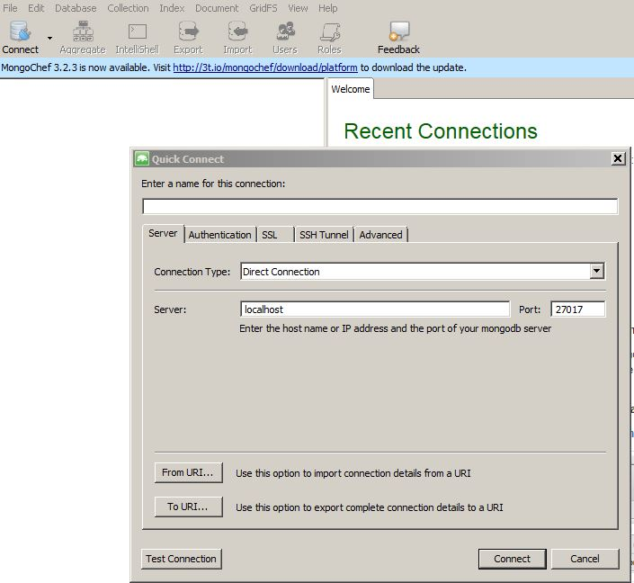
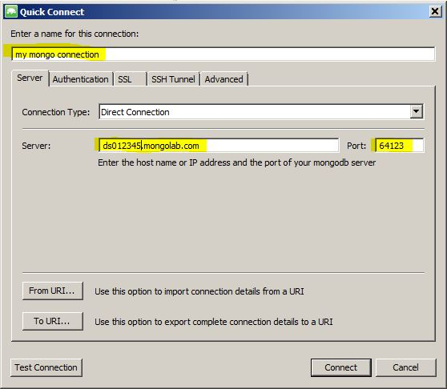

# Mongo DB Administration

Optional

Mongo DB ist eine eine Dokumentations - Datenbank, welche aus Collections (Sammlungen von Dokumenten) und Dokumenten besteht. Mongo DB ist eine [NoSQLDB](https://de.wikipedia.org/wiki/NoSQL) und schemafrei.Die Dokumente werden u.a. im JSON Format abgespeichert.  sinnvoll.

Ein Anbieter ist z.B. [3T Software Labs](http://3t.io/about-us) aus Berlin.
Der 3T MongoChef :http://3t.io/mongochef ist für den Privatgebrauch kostenlos.
Unter : http://3t.io/mongochef/download muss man sich registrieren und kann dann die Software für das jeweilige Betriebssystem herunterladen.

**Mit dieser Admin GUI  ist folgendes möglich:* **
1. Kopieren von Datenbanken und Collections

-> Dieses ist hilfreich, wenn man die mongodb umziehen möchte, z.B. von einem Standort   aus den USA zu einem Standort nach Europa. Man kann es auch als Backup Möglichkeit nutzen

2. Im- und Export von Dokumenten

-> Man kann sowohl csv-, als auch json - Dokumente im- bzw. exportieren. Die Daten aus der Cloud können lokal auf einen Rechner gespeichert werden, als Backup - Möglichkeit, oder zur Weiterverarbeitung im csv - Format

3. Erstellung von JSON Queries um BZ und andere Daten auszuwerten

  

 

Die Installation z.B. unter Windows ist eine Standard - Installation ohne speziell benötigte Parameter.

Beim Aufruf wird man aufgefordert, eine Connection = Verbindung zur Mongo DB zu konfigurieren. Dieses ist die URI aus vorhergehendem Kapitel.

**Connection:**
Klicke **Connect**, dann öffnet sich folgendes Fenster:

