# Anlegen eines Kontos auf https://carelink.minimed.eu  

Wir benötigen ein Konto auf CareLink und müssen mindestens einmal die Pumpendaten über das Contour Next Link 2.4 Messgerät auf Carelink hochladen. 
 
Gehe auf [https://carelink.minimed.eu](https://carelink.minimed.eu) und klicke auf „Jetzt anmelden“: 
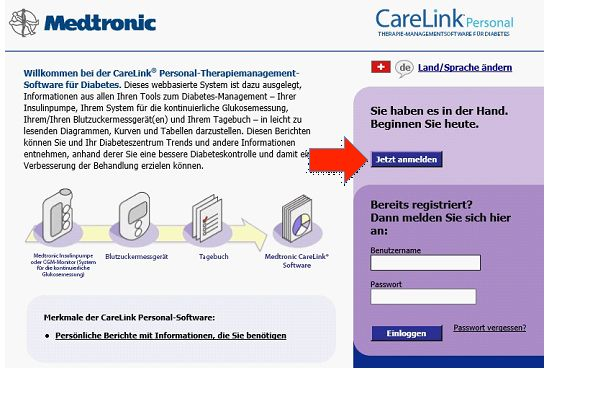
Wähle dein Land und deine Sprache aus: 
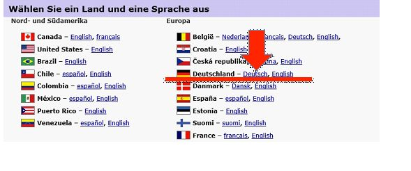
Nach dem Durchlesen der Nutzungsbedingungen akzeptiere diese, indem du diese drei Checkboxen klickst und „Akzeptieren“ klickst: 
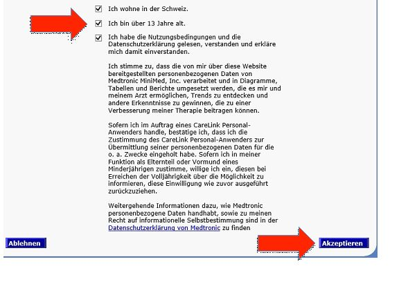
Fülle nun das Formular mit deinen Angaben aus. Bestätige, dass du kein Roboter bist, und klicke auf „Absenden“: 
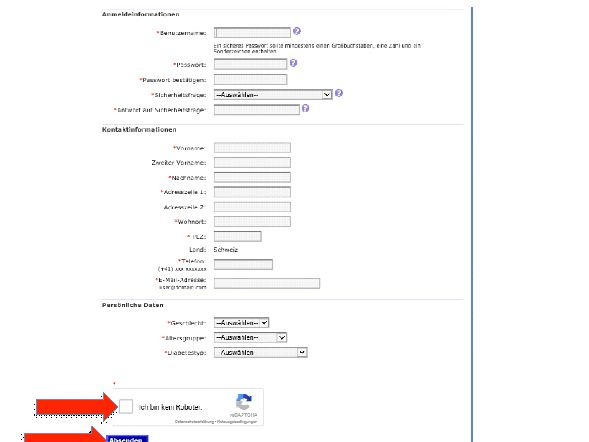

Nach dem „Absenden“ erscheint eine Bestätigungsseite: 
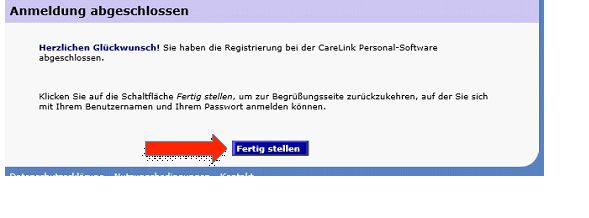
Nachdem du auf „Fertig stellen“ klickst, kommst du auf die Startseite zum Login. 
Gib deine vorhin erstellten Benutzernamen und Passwort ein und klicke auf „Einloggen“:
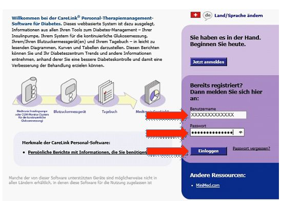

Wechsle nun auf den Reiter „Hochladen“: 
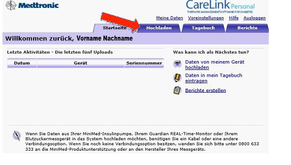
**Stecke** nun dein Contour Next Link 2.4 Messgerät in einen USB-Stecker deines Computers.  
**WICHTIG** ist, dass dieses Messgerät mit der Minimed 640G Pumpe bereits verbunden/gepaart wurde. (Eine Anleitung dazu findest du [hier](http://diabetes.ascensia.de/datafiles/pdf/userguides/Contour_NEXT_Link_2_4_User_Guide_de_mgdl.pdf).)  
**Die Pumpe** bzw. der/die Pumpenträger_in muss sich nun in der Nähe des Computers bzw. des angeschlossenen Messgeräts befinden. 
 
(Java muss auf dem Computer installiert sein und die Ausführung von Java erlaubt werden).  

**WICHTIG** ist, als Gerät „Minimed Insulinpumpe“ auszuwählen. Klicke nun auf „Weiter“ 
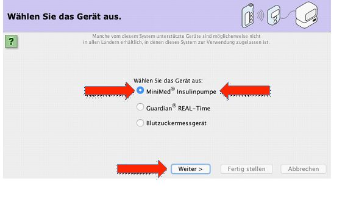
Wähle nun „Minimed Serie 600“ und klicke auf „weiter“: 

Du wirst nun gebeten 
* eine laufende Bolusabgabe abzuwarten/abzubrechen 
* eine laufende temporäre Basalrate abzuwarten/abzubrechen 
* zu kontrollieren, dass die Pumpenbatterie nicht schwach ist 
* etwaige Fehlermeldungen auf der Pumpe zu löschen 

Sofern alles stimmt, klicke auf „Weiter“
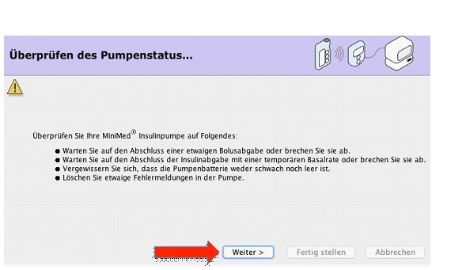

Nun musst du die Seriennummer der Pumpe eingeben und auf „Weiter“ klicken:

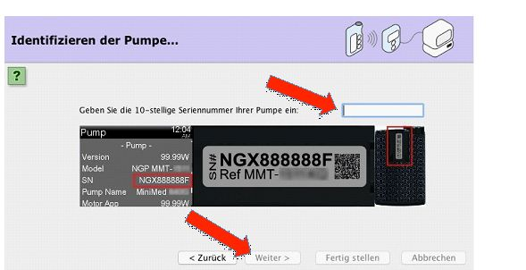

Wähle nun das Contour Next Link Messgerät aus und klicke auf „Weiter“:  

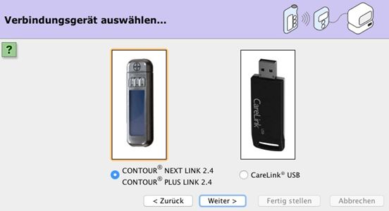

Stelle sicher, dass alle aufgeführten Punkte zutreffen und klicke auf „Fertigstellen“: 

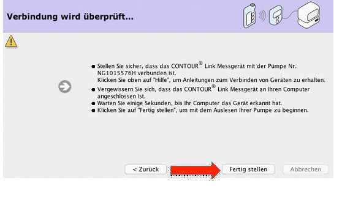

Die Pumpendaten werden nun ausgelesen:

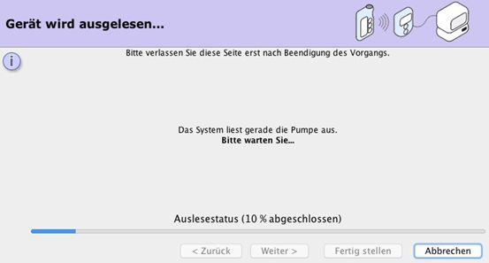

**Wichtig:** *Sollte die Verbindung zwischen Pumpe und Messgerät unterbrochen werden (z.B. durch das Auslesen der Pumpendaten in CareLink Pro bei einer 3-Monatskontrolle) kann es sein, dass das Auslesen auf CareLink (wie eben durchgeführt) erneut notwendig wird. Damit das nicht passiert empfiehlt es sich, ein zusätzliches Contour Next Link 2.4 Messgerät anzuschaffen, welches nur in Verbindung mit dem Android Smartphone steht und nicht für etwaiges manuelles Hochladen von Pumpendaten gebraucht wird (muss allerdings ebenfalls einmalig zum Auslesen der Pumpendaten gebraucht worden sein!). *