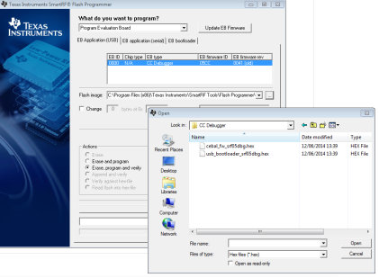
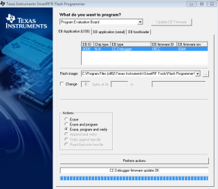

# Fehlerbehebung

Da die meisten Informationen in diesem Handbuch zum Thema MMCommander und Medtronic Uploader frei aus der entsprechenden englischen Installationsanleitung übersetzt wurden und dabei auch einige, nicht zwingend notwendige, Informationen weggelassen wurden, kann man eventuell [dort](http://github.com/jberian/mmcommander/install.pdf) auch weitere Informationen finden.

## Probleme beim Verbinden des CC Debuggers mit dem CC1111

Wenn die Verbindung zwischen den beiden Geräten nicht funktioniert, versucht man am besten, das Kabel auf dem CC1111 andersherum zu stecken. Dabei kann nichts kaputt gehen. Wenn auch diese Maßnahme nichts bringen sollte, dann könnte im Ausnahmefall das Kabel selbst das Problem sein. Als letzten Versuch könnte man die Nase des einen Steckers vorsichtig mit einem Messer entfernen und auch den Stecker im CC Debugger drehen.

## Probleme mit der Firmware des Debuggers

Normalerweise sollte es nicht nötig sein, diese Firmware zu aktualisieren, da es auch mit einer älteren Version der Firmware klappen sollte. Wenn es doch nötig sein sollte, weil man zum Beispiel Probleme beim Programmieren des CC1111 hat, dann trennt man zuerst den CC1111 vom CC Debugger. 
Im Pull-Down Menü des SmartRF Flash Programmers wählt man nun den Punkt "Program Evaluation Board" und klickt danach auf "Update EB Firmware" - dies geht übrigens nur, falls der Debugger eine ältere Version der Software hat. Danach sucht man die Datei mit der neuen Firmware aus z. B. C:\Programme\Texas Instruments\SmartRF Tools\Firmware\CC Debugger\cebal_fw_srf05dbg.hex (Version kann abweichen). Darauf achten, dass man nicht den Bootloader aktualisiert.

Anschließend sollte man eine aktualisierte "EB firmware rev" und "... update OK" sehen.

## Probleme mit dem CC Debugger

Wenn die CC Debugger LED rot leuchtet, dann sollte man die Verkabelung überprüfen und sicherstellen, dass sowohl der CC111 als auch der CC Debugger an USB Ports angeschlossen sind. Eventuell auch nochmal den Reset Knopf des Debuggers drücken.

Wenn die LED des CC Debuggers rot blinkt, dann hat der Debugger selbst einen Fehler und man sollte im englischen [TI's CC Debugger User Guide](http://www.ti.com/lit/pdf/swru197) nach Rat suchen.

## Grundsätzlich

Falls es immer noch Fehler gibt, die hier noch nicht gelöst wurden, dann empfiehlt sich ein Blick in die englische Originaldatei [install.pdf](https://github.com/jberian/mmcommander/blob/master/INSTALL.pdf), die der Autor geschrieben hat. 

