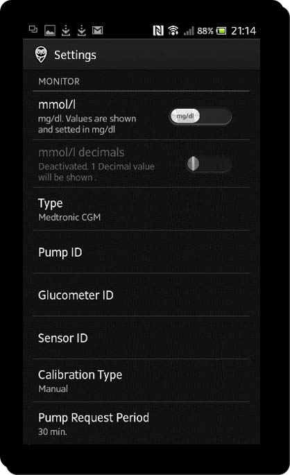
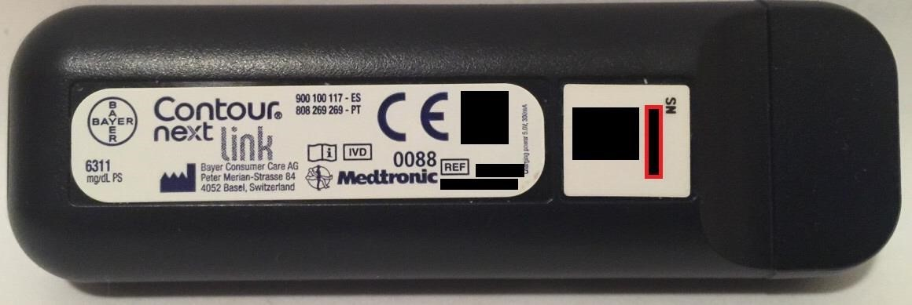
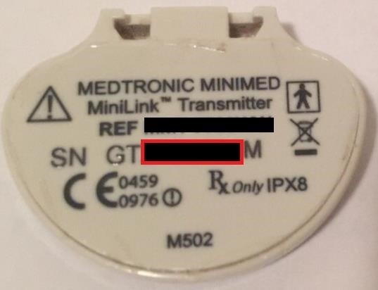

# Medtronic Uploader einrichten

Bevor die Medtronic Uploader App auf dem Android Smartphone konfiguriert werden kann, muss man die Schritte des Kapitels 2. [Nightscout einrichten](../../nightscout/nightscout_einrichten.md) , außer denen des Unterkapitels 2.3, vollzogen haben.

Nun installiert man die Datei "NightScout.apk" auf dem Smartphone. Eventuell muss man dazu unter Einstellungen - Sicherheit - Unbekannte Herkunft, die Installation von Apps aus unbekannten Quellen zulassen, da diese App nicht aus dem Play Store stammt. Dort gibt es nur den für Dexcom Empfänger gedachten "Nightscout Uploader".

Die Account-Information, die man auf dem Arbeitsblatt aus Kapitel 2.1. eingetragen hat, werden nun zum Konfigurieren der Medtronic Uploader App benötigt.

Zuerst muss die Medtronic Uploader App geschlossen werden, falls diese bereits läuft. Nun den MMCommander über das USB OTG Kabel an das Smartphone anschließen. Es sollte sich automatisch ein Fenster öffnen, welches fragt, was getan werden soll. Dort die Nightscout App auswählen ind diese sollte danach automatisch starten.

Jetzt wo der Uploader läuft, klickt man rechts oben auf die drei Punkte oder, abhängig vom jeweiligen Anroid Smartphone, man benutzt die Einstellungstaste des Gerätes. Es öffnet sich ein Menü und dort wählt man den Punkt "Preferences". Hier werden folgende Einstellungen vorgenommen:


* 
mmol/L -> hier kann man wählen, ob man lieber mit mmol/L oder mg/dl arbeitet.
* 
Type -> "Medtronic CGM" auswählen.
* 
Pump ID -> die ID von der Pumpenrückseite eintragen. Dies sind die sechs Ziffern, die auf dem folgenden Bild im Bereich des roten Rechteckes liegen.


* 
Glucometer ID -> die ID des Blutzuckermessgerätes eintragen (rotes Rechteck).


* 
Sensor ID -> die ID von der Rückseite des Minimed Transmitters eintragen (rotes Rechteck).


* 
Calibration Type -> "Manual" auswählen.
* 
Glucose Value Source -> "Medtronic Sensor" auswählen.
* 
API Upload (REST) -> aktivieren
* 
API Base URL -> ```APISECRET```@https:// ```WEBSEITENNAME```.azurewebsites.net/api/v1 eintragen. Sowohl das "API secret", als auch den "Webseitennamen" findet man auf der letzten Seite des Arbeitsblattes aus Kapitel 2.1. - vorausgesetzt man hat das Arbeitsblatt ausgefüllt. Mit den Beispielen aus Kapitel 2.5. [Azure](../../nightscout/azure.md) ergäbe sich dann: Y3KmrdFA12jmk@https://nscgm01.azurewebsites.net/api/v1.
* 
MongoDB Upload -> deaktivieren
* 
MongoDB REST Upload -> deaktivieren
* 
Wifi Hack -> deaktivieren
* 
2 Days at Startup -> aktivieren
* 
I UNDERSTAND -> hier steht ganz klar, dass Nightscout nicht genutzt werden darf, um medizinische Entscheidungen zu fällen. Es gibt weder Unterstützung noch irgendwelche Garantien. Die Qualität und Leistung dieses Projektes hängt einzig von Dir ab. Dieses Projekt wurde von Freiwilligen erstellt und weiter entwickelt. Dies muss man akzeptieren. -> aktivieren
* 
Logging Level -> Error

Nun geht man raus aus den Einstellungen. Man sollte Striche sehen, einen grünen Text "CGM Service Started" und einen weiteren Text "Uncalibrated".

Jedes Mal, wenn der Uploader Daten vom Sensor empfängt, erscheint folgender Text im unteren Teil des Bildschirms: "Medtronic CGM Message: sensor data value received". Sobald man den ersten Wert empfangen hat, klickt man wieder rechts oben auf die drei Punkte. Diesmal wählt man "Instant Calibration" und gibt den Wert ein, den man gerade auf der Pumpe abliest. Anschließend sollte der Uploader alle 5 Minuten einen Wert empfangen und diesen in die Mongo Datenbank hochladen.


Damit wäre der Medtronic Uploader eingerichtet. Es dauert nun noch etwa eine Viertelstunde, bis die ersten Werte über die persönliche Internetseite im Netz abrufbar sind. Ansonsten empfiehlt sich ein Blick in das Unterkapitel 1.3.6. [Fehlerbehebung](fehlerbehebung.md).

Man sollte die Kalibrierung mittels "Instant Calibration" jedes Mal durchführen, wenn der MMCommander erneut mit dem Smartphone verbunden wird.


