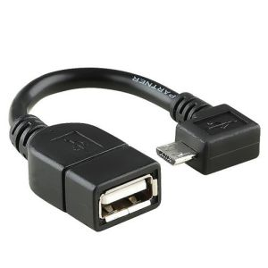
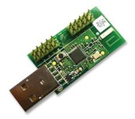
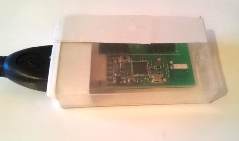

# Hardware

Um den MMCommander zu bauen, wird folgende Hardware benötigt:

- ein "geeignetes" **Android Smartphone** mit USB OTG Unterstützung. Ob ein bereits vorhandenes Smartphone geeignet ist, lässt sich leider nicht sicher vorhersagen. Als Orientierung kann man sich auf [www.nightscout.info](http://www.nightscout.info) eine Liste mit bestätigten Smartphones ansehen: ([Liste](http://www.nightscout.info/wp-content/uploads/2015/02/Nightscout-OTG-Database_CGMitC.xlsx.pdf)). Zusätzlich gibt es eine Liste mit Smartphones, die laut Nightscout.info **nicht** funktionieren:

 
* 
Kyocera Hydro 
* 
Samsung Mini – alle Modelle
* 
Moto E
* 
Straight Talk LG L34C Optimus Fuel
* 
LG Realm
* 
HTC Desire (außer AT&T Version)
* 
Core Prime
* 
Droid Bionic
* 
Droid Razr Maxx
* 
Droid Razr
* 
Geräte mit **Blackberry** Betriebssystem
* 
Geräte mit **iOS** Betriebssystem (Apple - Geräte)

Zusätzlich zu den Infos der Nightscout-Seite gibt es einen Bericht, bei dem ein HTC One (M7) mit Android 5.1 "Lollipop" nicht stabil funktionierte. Erfolgreich läuft der MMCommander mit einem Sony Xperia Z3 - ebenfalls mit Android 5.1 "Lollipop". Dieses Smartphone hat den Vorteil, dass man es über einen weiteren magnetischen Anschluss laden kann, während die Micro USB Buchse durch den MMCommander blockiert ist. Im Internet scheinen sich übrigens viele Nightscout-Benutzer für das kostengünstige Motorola Moto G entschieden zu haben.  

Ihr benötigt zusätzlich ein **USB-OTG Kabel** (Micro-USB Stecker  auf normale USB  Buchse) - zumeist empfiehlt es sich, einen gewinkelten USB-Stecker zu nehmen, wobei die sinnvolle Richtung vom verwendeten Smartphone abhängt. Man findet eine relativ große Auswahl bei Ebay oder Amazon. Die Kosten betragen etwa 5 €.

einen **CC1111 USB Dongle**, diesen Funk-Sender-Empfänger kann man z.B.  für 67 € bei [Farnell](http://de.farnell.com/texas-instruments/cc1111emk868-915/cc1111-rf-transceiver-eval-module/dp/2334589) oder [Digi-Key](http://www.digikey.de/product-detail/de/CC1111EMK868-915/296-22732-ND/1739551) bestellen.

zumindest einmalig zum Programmieren des CC1111 USB Dongles einen **CC Debugger**. Dieser kann für rund 44 € z.B. ebenfalls bei [Farnell](http://de.farnell.com/texas-instruments/cc-debugger/prog-debugger-f-rf-soc/dp/1752232?MER=baynote-1752232-pr) oder [Digi-Key](http://www.digikey.de/product-detail/de/CC-DEBUGGER/296-30207-ND/2231678) bestellt werden.

nicht zwingend notwendig, aber durchaus sinnvoll ist ein **Schutzgehäuse** für den CC1111. Es gibt bereits ein Plastikgehäuse, welches man [hier](http://www.shapeways.com/product/PGQ26J9UG/ti-cc1111-rf-transceiver-protective-case?li=shop-results&optionId=40496519) für knapp 20 € erwerben kann. Da der Anbieter mit dem Gehäuse kein Geld verdienen, sondern nur andere Nutzer unterstützen möchte, bietet er auch alternativ die Pläne [hier](https://www.tinkercad.com/things/2TzPZp0T0p1-cc1111-stick-usb-cable-protector) umsonst an, so dass man diese auch bei einem 3D Druck Service nach Wahl realisieren kann.
Eine weitere Möglichkeit ist einfach die Benutzung einer Tic-Tac Dose.

