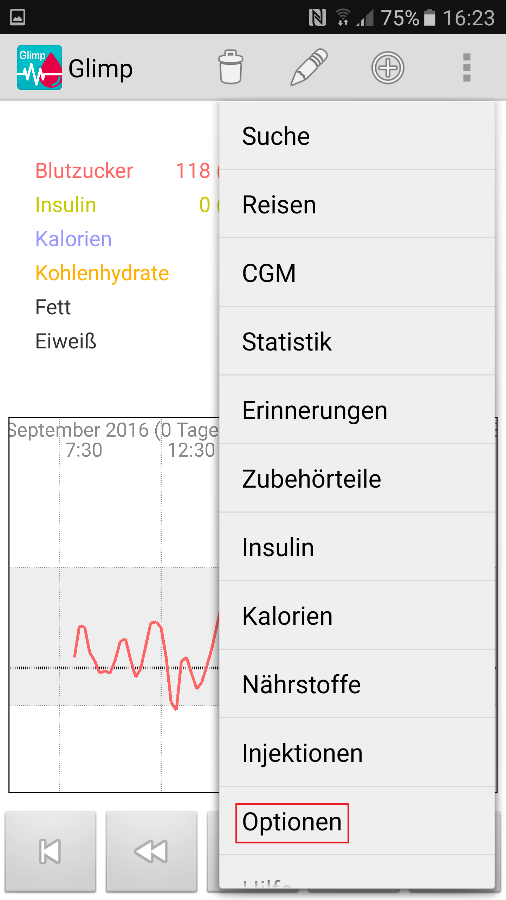
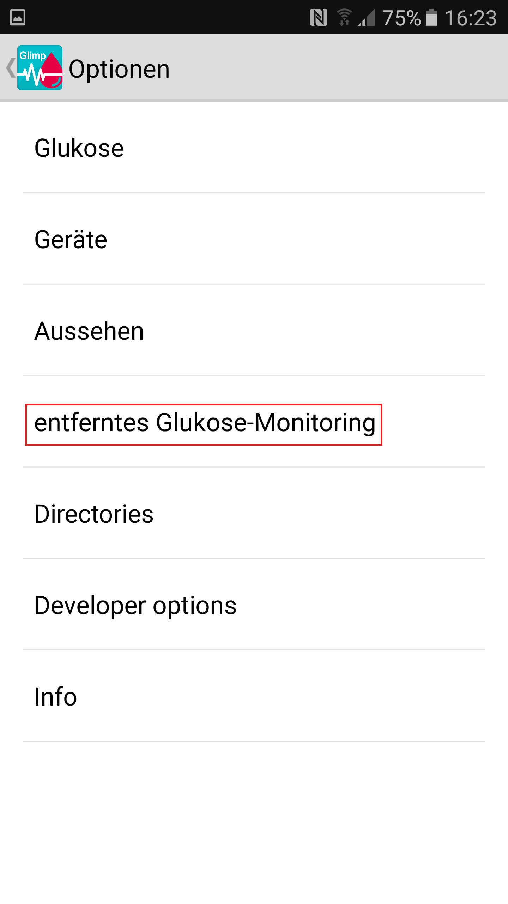
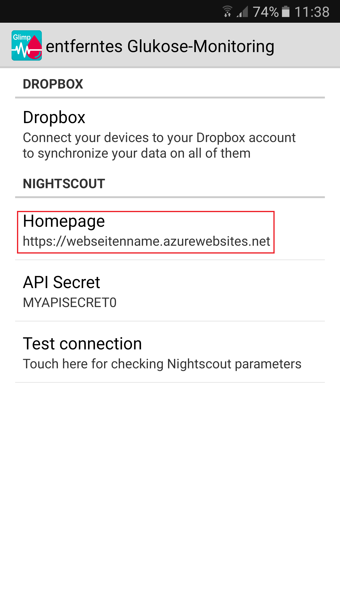
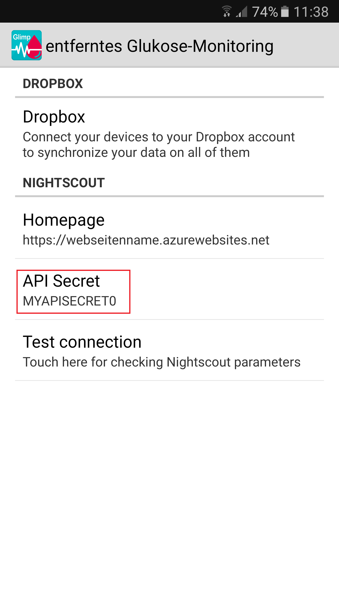
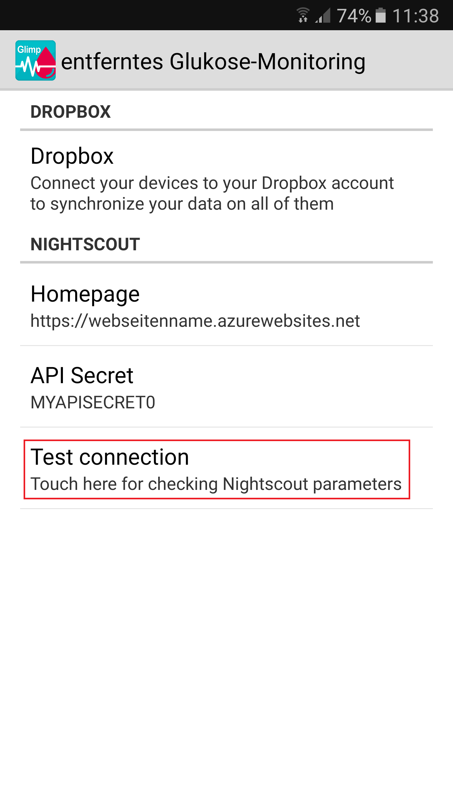

# Libre

Das Freestyle-Lesegerät selbst ist nicht Nightscout-fähig, jedoch die [Android-App Glimp](https://play.google.com/store/apps/details?id=it.ct.glicemia), die auch Sensoren auch auslesen kann. Dadurch ist eine Fernüberwachung möglich - z.B. durch die Eltern, die dann auf dem selben Stand wie das Kind sind und sehen ob und was gemessen wurde.
Mit der Android-App werden allerdings z.T. leicht andere Werte ausgelesen als vom Lesegerät.

## Nightscout mit FreeStyle Libre

Um Nightscout mit dem FreeStyle Libre nutzen zu können, braucht man:
* ein funktionierendes FreeStyle Libre System
* eine eingerichtete Nightscout Seite
* ein Android Smartphone, das NFC (Nahfeldkommunikation) unterstützt
* die [Glimp App](https://play.google.com/store/apps/details?id=it.ct.glicemia) aus dem Google Play Store

Falls man bisher noch keine Nightscout Seite eingerichtet hat, findet man alle erforderlichen Schritte im Kapitel [Nightscout einrichten](../nightscout/nightscout_einrichten.md). Wichtig ist dabei darauf zu achten, dass in Azure bzw. Heroku das CarePortal eingeschaltet wurde (dies geschieht, in dem man "careportal" bei der "ENABLE" Variable eingfügt. Auch muss in Azure bzw. Heroku ein "API_SECRET" gesetzt worden sein. Dies klingt komplizierter als, es in Wirklichkeit ist. Am besten Schritt für Schritt der Anleitung folgen ;-)

Viele aktuelle Android Smartphones unterstützen die NFC Technologie. Eine sehr gute, englischsprachige Liste findet man [hier](http://www.nfcworld.com/nfc-phones-list/).

### Daten des FreeStyle Libre mit Glimp hochladen

Um die Daten auf der Nightscout Seite angezeigt zu bekommen, müssen diese mit der Glimp App über das Smartphone vom Sensor gelesen werden und die App sendet die Daten dann zu Nightscout. Folgende Schritte sind dazu nötig:

1. die [Glimp App](https://play.google.com/store/apps/details?id=it.ct.glicemia) aus dem Google Play Store laden
2. Glimp konfigurieren damit es mit dem FreeStyle Libre zusammen arbeitet - das bedeutet am Telefon NFC einschalten und mit dem Smartphone den bereits gestarten Sensor scannen. Wenn nötig, dann kann man in der App auch noch eine Kalibrierung veranlassen, in dem man auf das "**+**" Zeichen klickt und einen BZ Wert  eingibt (eventuell mehrmals wiederholen).
3. Glimp für die Zusammenarbeit mit Nightscout konfigurieren. Dazu auf die 3 Punkte in der rechten, oberen Ecke klicken und danach auf "**Optionen**" klicken.

4. Jetzt "**entferntes Glucose-Monitoring**" wählen.

5. Auf der "entferntes Glucose-Monitoring"-Seite, gibt man jetzt die vorher erstellte Nightscout URL ein.

6. Jetzt das API SECRET eingeben (Anmerkung: das API SECRET *muss* identisch sein, mit das man bei der Konfiguration der Nightscout Seite bei Azure bzw. Heroku gesetzt hat.)

7. Nun auf "**Test connection**" klicken.

8. Wenn der Test erfolgreich war, dann ist Glimp nun fertig konfiguriert und lädt ab jetzt die mit der Glimp App gescannten Werte des Libre auf die Nightscout Seite.

