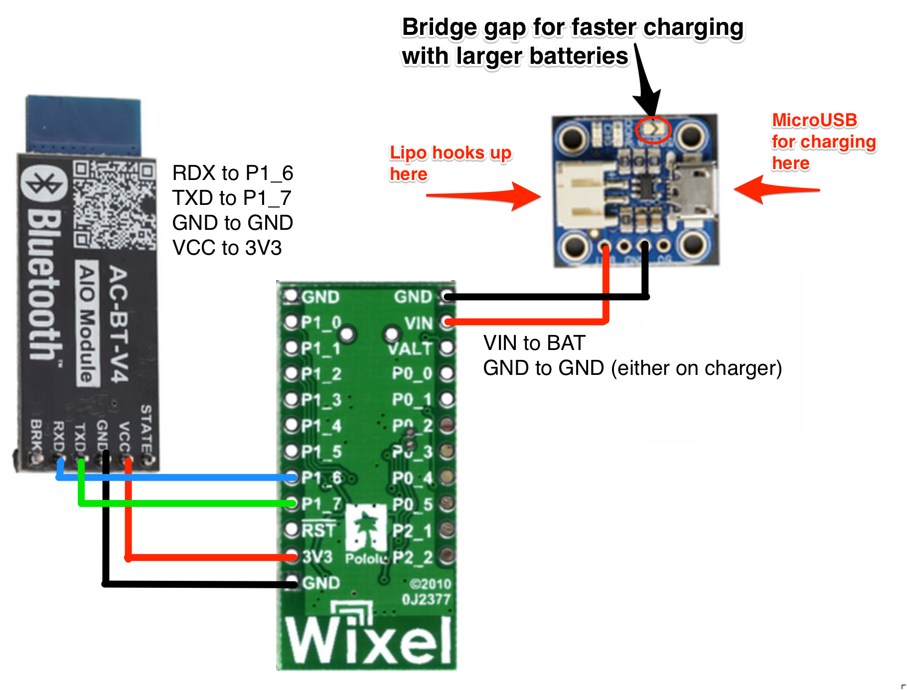
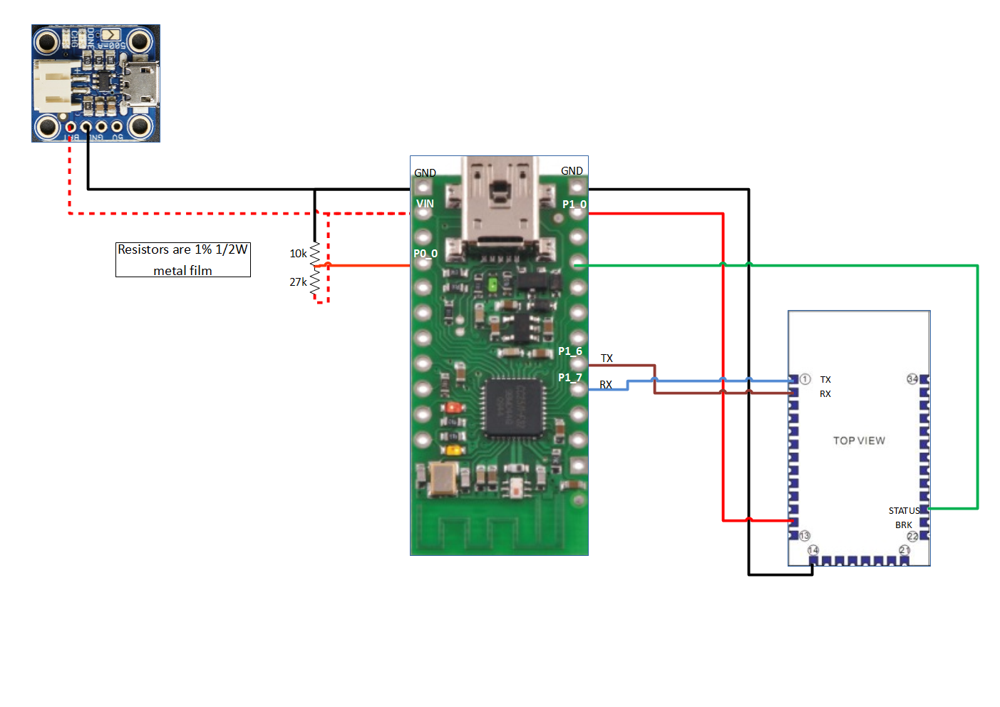
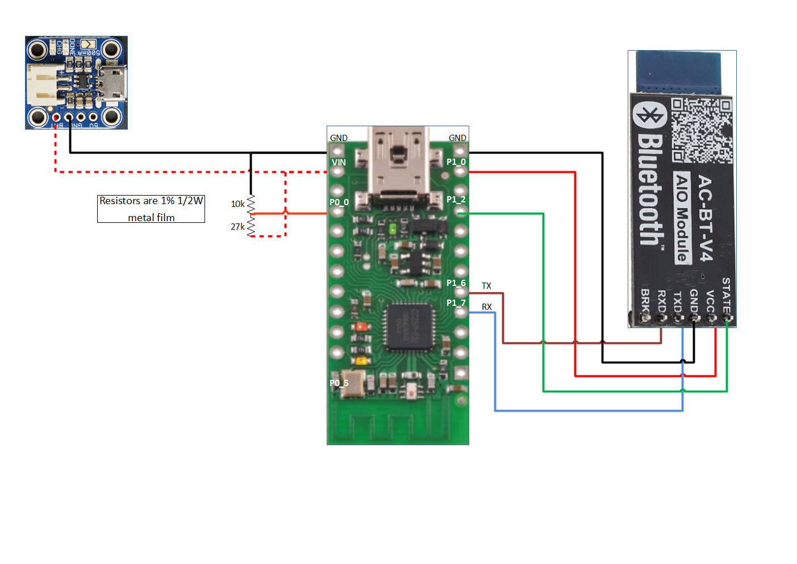
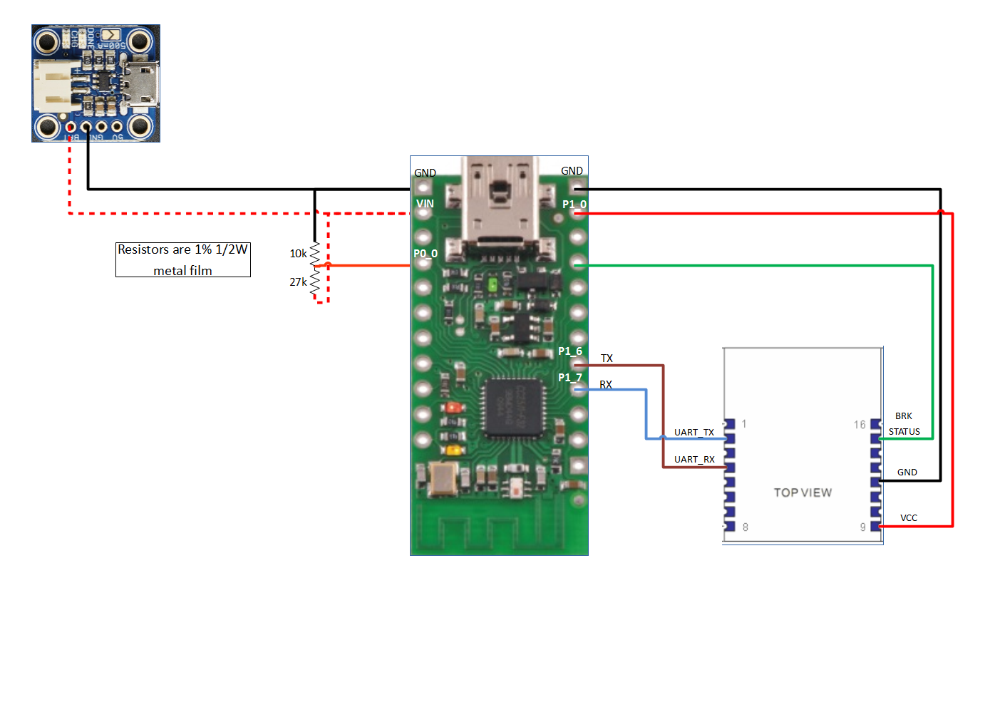
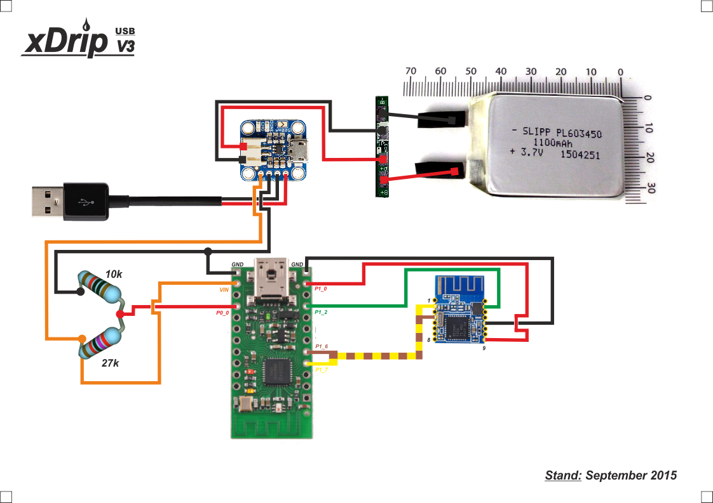

# Bausatz
Es gibt verschiedene Varianten, um ein xDrip zu bauen. Das betrifft die verwendete Hardware, die Art die Hardware zu verlöten und auch die Software. (Auf eines der Bauteile - das Wixel - wird eine Software aufgespielt.) 
Daher gibt es im Netz unterschiedliche Anleitungen und verschiedene Namen für ähnliche Dinge.
Die Varianten haben unterschiedliche Eigenschaften, letztlich aber dieselbe Aufgabe: CGM-Daten vom Transmitter zu empfangen und an ein Bluetooth-Handy zu übertragen.

Hier soll zunächst der Schwerpunkt darauf liegen, eine leichte Anleitung zum Nachbauen zu haben. Es ist nicht der Anspruch, alle bekannten Bauformen zu beschreiben. 

Hier werden drei verschiedene Bauformen vorgestellt. Eine "Bauform" meint eine Art, die Hardware-Komponenten miteinander zu verlöten.

Bauform 1.): "xDrip classic"  
Dies ist die einfachste Bauform. Es hat sich der Name der "xDrip classic" etabliert.  
Vorteil: Weniger Lötstellen. Einfach und robust. (Was nicht dran ist, kann nicht kaputt gehen.)  
Nachteil: Keine Anzeige der Akku-Ladung. Kürzere Laufzeit, als bei xBridge-Bauform.

Bauform 2.): "xDrip classic mit Spannungsteiler"  
Diese Bauform lohnt sich eigentlich nur dann, wenn mit möglichst geringem Aufwand ein "xDrip classic" um eine Anzeige der Akku-Ladung erweitert werden soll.  
Vorteil: Mit Anzeige der Akku-Ladung. Geringer Aufwand beim Umbau von "xDrip classic".  
Nachteil: Kürzere Laufzeit, als bei xBridge-Bauform.

Bauform 3.): "xBridge"  
Die Stromversorgung des Bluetooth-Moduls läuft etwas anders, als beim "xDrip classic". Im Vergleich zum "xDrip mit Spannungsteiler" müssen zwei Lötstellen mehr gelötet werden. Insbesondere müssen die Kabel für die Anbindung an das Bluetooth-Modul etwas anders geschaltet werden.  
Vorteil: Von den hier vorgestellten Varianten die längste Akku-Laufzeit. Von der Anzeige der Akku-Ladung bitte keine Wunder erwarten - es ist nur eine grobe Orientierung. Der aangezeigte Prozentwert sinkt nicht linear.   
Nachteil: Ungeeignet, wenn sich die Bluetooth-Verbindung zum Handy sich schlecht oder langsam aufbaut. 

## 
Tipps und Rat für Einsteiger: 
* Baut zunächst einen xDrip in der "klassischen Verschaltung".  
Es entfallen die beiden Widerstände, dafür fehlt in der App die Batterieanzeige. Wenn das später gewünscht ist, kann man diese Teile problemlos nachrüsten (und die Spannungsversorgung für das Bluetooth-Modul ggf. ändern).
* Verwendet für das Wixel die "xBridge2.wxl"-Software. Für alle hier gezeigten Schaltkreise/Bauformen ist diese Software geeignet.
* Große Akkus bringen (natürlich) eine längere Laufzeit. Es kann aber sein, dass ein großer Akku den Empfang der Antennen verschlechtert. Es kommen alle LiPo-Akkus mit 3,7V in Frage. Eine Empfehlung aus Erfahrungswerten ist, für xDrip classic mindestens 500 mAh verwenden. Große Akkus mit 1100 mAh und mehr bieten auch für xDrip classic mehrere Tage Laufzeit. Für "xBridge"-Schaltkreise  können schon Akkus ab 200 mAh mehr als 24 Stunden Laufzeit erreichen. (Tipp aus der Praxis: In aller Regel kann man den Akku über Nacht aufladen - extrem lange Laufzeiten sind also in vielen Fällen unnötig. Das Handy wird ja in aller Regel auch über Nacht aufgeladen... Um etwas Puffer zu haben: Empfehlung etwa 400 bis 500 mAh nehmen.)
* Die Brücke "for faster charging with large batteries" beeinflusst den Ladestrom. Ist die Brücke geöffnet, fließen 100 mA. Wird sie geschlossen, fließen 500 mA. Ein kleinerer Ladestrom schont den Akku - aber die Ladezeit erhöht sich.  
Der Akku-Hersteller empfiehlt, die Brücke für Akkus ab 500 mAh zu schließen. 
Zur Information: LiPo Akkus können sich beim Laden erhitzen. Laut Wikipedia kann das eine ernste Brandgefahr mit sich bringen.
* Die Kabel können sehr dünn sein - das erhöht die Flexibilität. Verschiedene Farben machen es leichter, die Übersicht zu behalten, solange der xDrip noch im Bau ist. 
* Das Schutzmodul für Lipo-Akkus (unten in der Stückliste mit Nr. 2) hat sich in einem Fall nicht bewährt: Es gab fortwährendes Ein- und Ausschalten. Das könnte am kleinen Akku gelegen haben. Evtl. war es aber Pech oder fehlerhaft verlötet. Im Prinzip ist ein Schutz vor Tiefenentladung sicher sehr sinnvoll. Die Schaltkreise funktionieren aber auch ohne dieses Modul.
* In den Schaltbildern sind keine Schalter eingetragen. Ein Schalter kann sinnvoll sein, um  einen zweiten (geladenen, aber abgeschalteten) xDrip als Ersatz dabei haben zu können. Ggf. kann das xDrip abgeschaltet werden, wenn absehbar ist, dass für eine Zeit keine Daten empfangen werden können. (CGM vorübergehend abgelegt, während des Schwimmengehens,...).

## 

**Schaltbild für xDrip in der "klassischen Verschaltung" (Empfehlung für Einsteiger)**

(ohne Widerstände für Batterieanzeige)

** Hinweise zum Löten: **
* Wenn ihr ein anderes Bluetooth-Modul habt als in der Abbildung dargestellt, achtet auf die korrekte Verlötung vom Wixel zum Bluetooth-Modul. (Achtet auf die Beschriftung der Pins in der Abbildung).
* Anleitung zum Löten: [Film](https://www.youtube.com/watch?v=YuxCUeJ9xAU&feature=youtu.be)

** Zur Software auf dem Wixel: **
* xBridge Firmware: [xBridge2.wxl](https://github.com/jstevensog/wixel-sdk/raw/master/apps/xBridge2/xBridge2.wxl) (Auch empfohlen bei Verlötung nach "xDrip classic".)
* Software zum Aufspielen der wxl-Datei auf das Wixel [Wixel Configuration Utility](https://www.pololu.com/product/1337/resources)
*  Weitere Infos: siehe [hier](https://github.com/jstevensog/wixel-sdk/blob/master/apps/xBridge2/xBridge2.pdf) 
*  Tipp: Wenn auf dem Wixel schon eine xBridge2.wxl Software aufgespielt ist, dann legt die Software das Wixel zyklisch in einen passiven Modus. In dieser Zeit kannst Du das Wixel nicht via USB-Kabel mit dem PC verbinden.  
Es gibt zwei Möglichkeiten: Warten, bis das Wixel (alle 5 Minuten) aufwacht, die Verbindung aufbauen und in der "Wixel Configuration Utility" die Anwendung auf dem Wixel stoppen. Oder das Wixel kurz von der Spannungsversorgung trennen und dann die Verbindung aufbauen.

** Info zu den Widerständen: ** (wichtig für die Batterie-Anzeige) 
* "xDrip classic" (ohne Spannungsteiler)
* "xDrip classic zzgl. Spannungsteiler". Dann muss der Spannungsteiler ein Verhältnis von 1:2,2 haben. Also (1k und 2,2k) ODER (10k und 22k).
* "xBridge" (incl. Spannungsteiler). Dann muss der Spannungsteiler ein Verhältnis von 1:2,7 haben. Empfohlen werden 10k und 27k.
* Wenn Widerstände neu eingebaut wurden, wenn die eingebauten Widerstände verändert wurden oder wenn der Akku getauscht wurde, muss anschließend die xBridge2.wxl neu aufgespielt werden. Sonst stimmen die "angelernten" Werte nicht und die angezeigten Werte des Battery-Levels in der xDrip-App sind falsch. 
* Metallschicht-Widerstände sind etwas größer und damit leichter zu handhaben. Es können auch CMD-Widerstände genutzt werden. Damit kann man etwas Platz sparen, aber man braucht dann wirklich eine ruhige Hand beim Löten.

---
Anzeigen der LED (bzw. in der App) und die Bedeutung (mit xBridge2.wxl auf dem Wixel).

Erklärung zur folgenden Tabelle:

* **Die Inhalte sind noch nicht abgesichert. **
* "~~grün~~" bedeutet: Es gibt verschiedene Bauformen für die Bluetooth-Module (HM10 und HM11), die Farbe der LED kann eine andere sein.
* "-" bedeutet: Diese Anzeige sollte nicht vorkommen.

| Bauteil | Anzeige | xDrip classic | xDrip classic mit Spannungsteiler | xBridge|
| -- | -- | -- | -- | -- |
| HM17 | -- | -- | -- | -- |
| HM11 | Klärung nötig ||||
| HM10 | ~~grün~~ Dauerleuchten | Regelbetrieb | Regelbetrieb | -  |
| HM10 | ~~grün~~ blinkend | keine BT-Verbindung zum Handy | keine BT-Verbindung zum Handy | keine BT-Verbindung zum Handy|
| HM10 | ~~grün~~ aus, aber alle 5 Minuten kurzes Blinken, dann ca. 30 Sek. an |  -  |  -  | Regelbetrieb|
| Wixel | orange Dauerblinken | keine Verbindung zum Transmitter | keine Verbindung zum Transmitter |  -  |
| Wixel | orange Dauerleuchten |  -  |  -  | keine Verbindung zum Transmitter|
| Wixel | orange alle 5 Minuten blinkend | Regelbetrieb | Regelbetrieb |  - |
| Wixel | orange alle 5 Minuten ca. 30 Sek. Dauerleuchten | - | - | Regelbetrieb| 
| Wixel | ab und zu orange und rot gleichzeitig | ? | ? | ?| 
| App Statusanzeige | "not connected" dauerhaft | keine Verbindung zum BT-Modul | keine Verbindung zum BT-Modul |keine Verbindung zum BT-Modul |
| App Statusanzeige | "not connected", aber alle 5 Minuten für ca. 30 Sek "connected" | - | - | Regelbetrieb (!) |
| App Statusanzeige | "connected" dauerhaft | Regelbetrieb |Regelbetrieb | - |

## 

** Stückliste ** ( Stand: September 2015 )

|Nr.| Bemerkung| Bauteil: | Vertrieb: | Verkaufspreis: | Artikelnummer: | Hersteller-Nr.: |
| -- | -- | -- | -- | -- |
|1| optional|[IC Lithium-Polymer Akku-Schutzschaltung](http://www.voelkner.de/products/128243/IC-Lithium-Polymer-Akku-Schutzschaltung.html) | Voelkner |2,96 € | Q33939 | S-8261ABJMD-G3J2G |
|2| optional (und Alternative zu 1)|[Schutzmodul für Lithium-Polymer-Akkumulator S-8261ABJMD-G3J2G](https://www.conrad.de/de/schutzmodul-fuer-lithium-polymer-akkumulator-s-8261abjmd-g3j2g-gehaeuseart-aufgebaute-platine-ausfuehrung-schutzmodul-fuer-lithium-polymer-akkumulator-155151.html?ref=searchDetail) | Conrad | 2,96 € | 155151 - VQ | S-8261ABJMD-G3J2G |
|3| notwendig|[Pololu Wixel Programmable USB Wireless Module](http://www.exp-tech.de/pololu-wixel-programmable-usb-wireless-module)| EXP TECH | 18,60 € | EXP-R25-070 | Pololu  1337 |
|4| notwendig| [Adafruit Mini Lipo w/Mini-B USB Jack - USB LiIon/LiPoly charger](http://www.exp-tech.de/adafruit-mini-lipo-w-mini-b-usb-jack-usb-liion-lipoly-charger) | EXP TECH | 7,65 € | EXP-R15-446 | Adafruit  1905 |
|5| notwendig, alternativ auch HM10 möglich |[Seeed Studio Bluetooth V4.0 HM-11 BLE Module](http://www.exp-tech.de/seeed-studio-bluetooth-v4-0-hm-11-ble-module) | EXP TECH | 12,28 € | EXP-R02-308 | Seeed Studio  210005001 |
|6| optional|[ Handgehäuse Minitec El, 78x48x20, Lava/Grün](http://www.voelkner.de/products/213275/Minitec-El-78x48x20-Lava-Gruen.html) | Voelkner | 12,38 € | S23261 | D9006178 |
|7| optional, Alternative zu 6 |[Hand-Gehäuse Kunststoff Lava, Grün 78 x 48 x 20 OKW D9006178 1 Set](https://www.conrad.de/de/hand-gehaeuse-78-x-48-x-20-kunststoff-lava-gruen-okw-minitec-d9006178-1-set-535384.html?ref=searchDetail) | Conrad | 13,57 € | 535384 - 62 | D9006178 |
|8| notwendig, oder ein anderer 3,7v LiPo-Akku | [Lipo Akku 1100 mAh 3,7V Einzelzelle](http://shop.lipopower.de/1100-mAh-37V-Einzelzelle-1C-34mm-breit)  | Lipopower.de | 6,95 € | 7.011.0-11_34 | 1C 603450 |  |
|9| optional (für Batterieanzeige bei **xBridge**-Schaltung)| Metallschichtwiderstand 1%, 0,5 Watt je ein Stück 10k und 27k |  |  |  |  |
|10| optional (für Batterieanzeige bei **xDrip**-Schaltung)| Metallschichtwiderstand 1%, 0,5 Watt je ein Stück 10k und 22k |  |  |  |  |
|11| notwendig |flexible Leitungen (dünn) [Beispiel](http://www.exp-tech.de/silicone-cover-stranded-core-wire-30awg-black) | exp-tech.de | 0,80 €  | EXP-R15-686 | Adafruit |
|12| notwendig| Lötzinn, Lötkolben |  |  |  |  |
|13| optional, aber empfehlenswert| Schrumpfschlauch |  |  |  |  |
|14| optional, aber empfehlenswert| "dritte Hand" ein Beispiel: [Link](http://www.amazon.de/Silverline-633830-Dritte-Hand-Lupe/dp/B000O3RJFC/ref=sr_1_4?ie=UTF8&qid=1453657700&sr=8-4&keywords=dritte+hand) |  |  |  |  |
|15| optional | Epoxid Trennschicht |  |  |  |  |
|16| notwendig | Kabel mit Mini-USB-Stecker, um das Wixel zu bespielen | Beispiel: [Link](http://www.amazon.de/dp/B00NH11N5A)  |  |  |  |
Hinweis: Es gibt Erfahrungsberichte, die besagen, dass ein HM17 sich ebenso verwenden lässt.

---
###Weiterführende Infos / Schaltbilder für xBridge

Alternative Schaltbilder / Varianten; wenn die Einsteiger-Variante "xDrip-classic" nicht gewünscht ist.
Es gibt verschiedene Bluetooth-Module: HM10, HM11 oder HM-17 für die es verschiedene Bauformen gibt. Deswegen hier mehrere Bilder zur Verschaltung. Sucht euch das Bild raus, das zu eurem konkreten HM Modul passt. Falls ihr eine xDrip-Schaltung baut, könnt ihr aus den folgenden Abbildungen auch die Bezeichnungen der Anschlüsse ablesen.

**Schaltbild für xBridge mit HM-10**

**Schaltbild für xBridge mit HM-10 auf Breakout Board**

**Schaltbild für xBridge mit HM-11**

**Schaltbild für "xDrip USB V3"**

** Weitere Infos / empfohlene Links: ** (englische Seiten) 
* zu xBridge2: Ein [PDF](https://github.com/jstevensog/wixel-sdk/raw/master/apps/xBridge2/xBridge2.pdf) Dokument findet sich in diesem [Repository](https://github.com/jstevensog/wixel-sdk)
* Eine weitere Seite mit Anleitungen findet sich [hier](http://circles-of-blue.winchcombe.org/index.php/2015/01/11/wearenotwaiting-thanks-to-dexdrip-introduction/)
* Wichtige Quellen zu xDrip finden sich an diesen Stellen: [hier](https://github.com/StephenBlackWasAlreadyTaken/wixel-xDrip) und [hier](http://stephenblackwasalreadytaken.github.io/xDrip/) und [hier](https://github.com/StephenBlackWasAlreadyTaken/xDrip/blob/gh-pages/hardware_setup.md)
