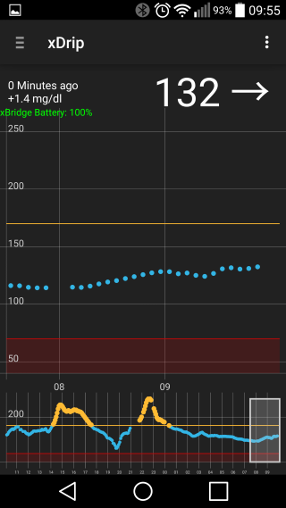
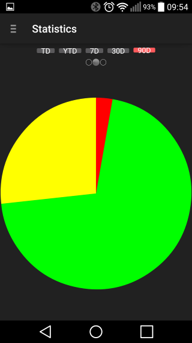
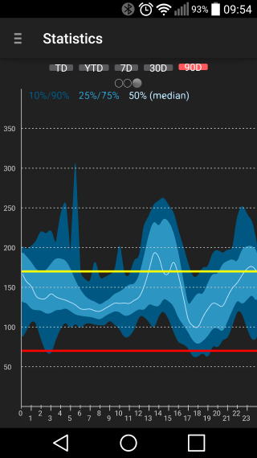

# xDrip App

Die xDrip-App ist eine Anwendung (eine App), die auf einem Android-Handy läuft. Sie dient dazu, CGM-Werte auf dem Mobiltelefon und einer Smart-Watch anzuzeigen, auszuwerten und bei Bedarf zu NightScout hochzuladen.
Um die Werte zu erhalten, benötigt man entweder ein Dexcom G4 *with Share* oder einen selbstgebauten Bausatz. Da *Share* in Europa nicht erhätlich ist, beschränkt sich dieses Handbuch auf den Bausatz.

##Voraussetzungen:
1. Android-Telefon mit Betriebssystem-Version 4.3 (besser 4.4 oder höher)
2. Bluetooth-Low-Energy (BLE)-Funktionalität. Diese ist in der Regel ab Bluetooth 4.0 vorhanden.
3. xDrip-Bausatz (s. Kapitel Bausatz) oder Dexcom-Share-Receiver (nur USA)

---
##Screenshots:
 

 

 
---

## Grund-Funktionalität:
### Download & Installation
Die xDrip-App wird derzeit (Stand 01/2016) noch häufig angepasst. Der Download für eine lauffähige Version (*.apk-File) findet sich hier: [Link zur Beta-Version](https://github.com/StephenBlackWasAlreadyTaken/xDrip/wiki/xdrip-beta)

Die hier verlinkten Versionen sind so erstellt, dass man eine ältere Version mit einer neueren updaten kann, ohne Einstellungen und Messwerte zu verlieren.
Wer hinreichende technische Kenntnisse hat, kann sich aus den Sourcen selbst die apk kompilieren. 

### Verbinden mit dem Wixel: Bluetooth-Scan / Hardware data source
Hier wird eingestellt, mit welcher Hardware die Daten vom Transmitter empfangen und an die xDrip-App übergeben werden.
* Bluetooth Wixel  
xDrip in classic - xml. Selbst kompilierte wxl, in die die individuelle Transmitter-ID einkompliliert wurde. Erstellt gemäß dieser [Anleitung](https://github.com/StephenBlackWasAlreadyTaken/wixel-xDrip)  
Link: https://github.com/StephenBlackWasAlreadyTaken/wixel-xDrip
* xBridge Wixel  
xDrip in xBridge2 wxl. Aus dieser [Quelle](https://github.com/jstevensog/wixel-sdk)
* Wifi Wixel  
Weitere Infos, siehe: ?
* Wifi Wixel + BT Wixel  
Kombination aus Wifi-Wixel und BT-Wixel. Bsp: Zu Hause mehrere Wixel im WLAN, die im ganzen Haus den Empfang sicherstellen. Außerhalb des WLANs werden die Daten vom BT-Wixel empfangen. Weitere Infos: https://github.com/jamorham/python-usb-wixel-xdrip 
* DexcomShare  
DexcomShare ist zZt. in Europa nicht verfügbar. Weitere Infos: http://www.dexcom.com/dexcom-g4-platinum-share

### Starten des Sensors
### Kalibrieren
### Alarme
#### BG-Level-Alerts
Unter Settings - Alerts and Notifications - BG Level Alerts kann man sich Alarme einstellen für den Fall, dass der BZ einen bestimmten Wert über- (Hochalarm) oder unterschreitet (Tiefalarm). Der Tiefalarm für Werte unter 55mg/dl ist vom System bereits voreingestellt und kann nicht verändert werden.

Drücke "create low alert", um einen Tiefalarm selbst zu definieren. Unter "Alert Name" gibst du dem Alarm eine von dir ausgewählte Bezeichnung, z.B. zu niedrig 80. Bei "Threshold" tippst du den entsprechenden Wert (hier z.B. 80) ein. Unter "Default Snooze" gibst du die Minuten ein, nach denen sich der Alarm erneut melden soll, wenn du ihn gestoppt hast, der Wert aber nach wie vor zu tief ist; unter "Re-raise" die Minuten, nach denen sich der Alarm erneut melden soll, wenn du ihn ignoriert hast, der Wert aber nach wie vor zu tief ist. Hier empfiehlt es sich bei Tiefalarmen einen kürzeren Zeitraum auszuwählen. Unter "Alert Tone" kannst du dir einen entsprechenden Alarmton bestimmen bzw. mit "choose file" aus deinem Smartphonerepertoire aussuchen. 
Unter "select time for alert" ist "all day" bereits mit Häkchen versehen, so dass dein Alarm ganztägig funktioniert. Du kannst aber auch auf "all day" tippen, um dann mit "tap to change" einen gewissen Zeitraum (z.B. die Nacht) festzulegen. Du kannst den Alarm über "override phone silent mode" auch im Ruhemodus klingen lassen und das Telefon beim Alarm außerdem vibrieren lassen mit Häkchen an "vibrate on alert". Zuletzt kannst du den Alarm noch testen und vergiss nicht, ihn zu speichern ("save alert"), wenn er dir zusagt!

Entsprechend kannst du über "create high alert" eine Alarmkaskade nach oben schaffen.

Bei einmal gespeicherten Alarmen kommst du durch längeres Antippen des gewünschten Alarmes in den Bearbeitungsmodus.

#### BG-Alert-Settings
##### Profil: High, Ascending, ...
##### Smart snoozing/alerting: Empfehlung am Anfang diese zu deaktivieren.
#### Rise-Fall-Alerts
#### Calibration Alerts

## Verbinden mit einer Smartwatch:
An dieser Stelle wäre es möglich, die Daten direkt an die Smartwatch zu senden. Damit könnte man die Installationsschritte in "Nightscout einrichten" umgehen. Damit wiederherum umgeht man aber auch die Möglichkeit, die Daten weiter zu nutzen. (Als Überwachungsfunktion, als Tagebuch oder für das APS)
### Android Wear
### Pebble

## Upload zu NightScout:

## Weiteres:
### Settings
|Name|Bedeutung|Empfehlung für Einsteiger|
|--|--|--|
|Bg Units| "mg/dl" oder "mmol"| -|
| High Value | Grenze, ab der ein Wert in der Anzeige und Statistik als "zu hoch" gewertet wird. | -|
| Low Value | Grenze, ab der ein Wert in der Anzeige und Statistik als "zu tief" gewertet wird. | -|
|...|
| Display Bridge Battery| Sofern ein Spannungsteiler eingebaut wurde, kann eine Batterie-Anzeige gemacht werden| Nur aktivieren, wenn ein Spannungsteiler verbaut wurde.|
| Run Collection Service in foreground| Klärung nötig: Kann das die BT-Verbindung tatsächlich verbessern? Zeigt in den Statusmeldungen und ggf. im Lockscreen den Wert mit Tendenz an.| aktivieren |
### Widgets
### Werte vorlesen lassen
### Statistik

Wenn man im xdrip Menü den Punkt Statistics antippt, gelangt man zu den Statistiken für verschiedene Zeiträume, die man wiederum durch Antippen auswählen kann.
TD = today, heute YTD = yesterday, gestern 7/30/90d d = Tage

Hierzu gibt es drei Seiten, die man durch Wischen nach links bzw. rechts aufrufen kann. Auf welcher der Seiten man sich befindet, erkennt man an der Veränderung der drei kleinen Kreise direkt unter der Leiste mit den Zeiträumen von ungefüllten zu gefüllten Kreisen.

Die linke der drei Seiten enthält Informationstext:
Range, auf Deutsch: Spannweite, gibt die Verteilung der gemessenen Werte an, unterteilt nach in/high/low, auf Deutsch: innerhalb der Grenzwerte/höher/tiefer.
Absolute numbers: Dies sind die absoluten Zahlen der jeweils in den genannten Bereichen gemessenen Werte.
Der Median BG ist das arithmetische Mittel der gemessenen Werte (Bsp: 1+3+5+5+9=23/5=4,6).
Der Mean BG ist der Wert in der Mitte der gemessenen Werte, damit werden Ausreißer nicht berücksichtigt (Bsp: 1, 3, 5, 5, 9=5).
HbA1c est. (estimated, auf Deutsch: geschätzt) Hier wird je nach angetipptem Zeitraum der HbA1c in mmol/l und in mg/dl überschlägig berechnet.
StdDev steht für standard deviation, auf Deutsch: Standardabweichung. Sie zeigt die durchschnittliche Abweichung der Werte vom Mittelwert an.

Auf der mittleren Seite sind die Werte je nach ausgewähltem Zeitraum in ihrer Verteilung als Tortengrafik dargestellt. Grün steht für innerhalb der Grenzwerte, gelb für hoch und rot für tief.

Auf der rechten Seite wird für jeden ausgewählten Zeitraum die Werteverteilung in einer Verlaufskurve im Tagesablauf gezeigt.

### Transmitter-Batterie-Info
### xBridge-Batterie-Info
### Interne Daten (Datatables + Calibration Graph)

### Fragen/Probleme und Antworten/Lösungen
1. **Frage:** In der xDrip-App wird das Bluetooth-Modul gefunden als "hm-soft", nicht als „xBridge“ oder „xDrip“.  
Was muss ich tun, damit das neue xDrip (richtig) funktioniert?  
**Antwort: **  
Sobald der BT-Chip Strom hat, kann sich das Handy damit verbinden. Das heißt leider noch nicht, dass die Daten-Leitung Wixel->BT-Chip passt.
Klicke im System Status auf "forget device", Wixel kurz stromlos machen und danach neu verbinden. 
Wenn danach der Chip immer noch "hm-soft" heißt, dann stimmt irgendetwas mit der Kommunikation vom Wixel zum BT-Chip nicht.  
.1 Verkabelung zwischen Wixel und Bluetooth-Modul prüfen.  
.2 Baud-Rate prüfen.  Bei einigen HM11-Modulen ist die Baudrate falsch gesetzt. Ggf. also die Baudrate einstellen.

1. **Frage:** nächster Punkt kommt dann hierher

	

