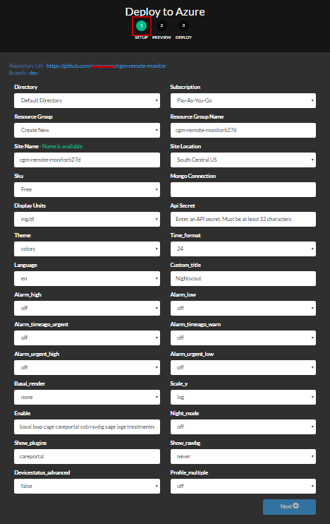
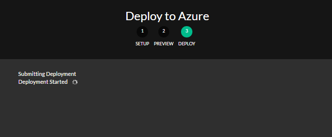
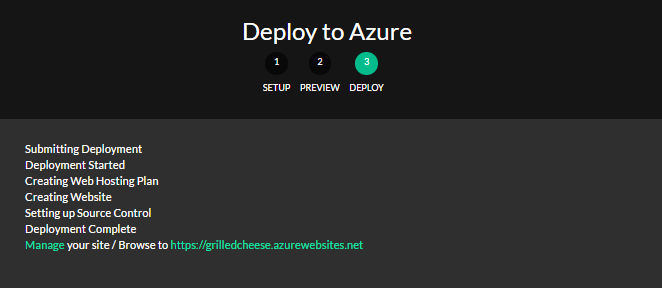
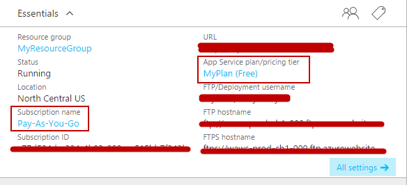

# Der **Deploy to Azure** Button
Die Nightscout Website lässt sich mit vielen Standardeinstellungen beschleunigt installieren.
Wir Starten mit der Anmeldung in Azure.
Danach melden wir uns in Github an, navigieren in unserer Repository und den Branch, welchen wir installieren wollen.

Weiter Klicken auf das **Deploy to Azure** Symbol:

Wir loggen uns bei Azure ein (folgt den angezeigten Anweisungen, um eingeloggt zu werden). (Wenn wir noch kein Azure-Konto haben, sollten wir das Azure-Konto zunächst separat hinzufügen und dann wieder in diese Sequenz von Schritten zurückkehren.
Es ist möglich, das Konto an dieser Stelle einzurichten, aber es kann weniger verwirrend sein Wenn wir das Konto vorher erstellen.)
Der Bildschirm "Deploy to Azure" wird mit allen Optionen geladen, die wir (am Anfang) für unsere Website konfigurieren können. (Wir können dieses später bei Bedarf ändern.)

Es erscheint diese Web - Maske:

Wir stellen sicher, dass das Abonnement `Pay-as-you-go zeigt`. (Wenn das Konto neu angelegt ist, kann es stattdessen die kostenlose Testversion zeigen, und wir müssen dieses ändern, bevor der Testphase endet.)
Wenn eine Ressourcengruppe im Dropdown-Menü aufgelistet ist, wählen wir sie aus. Ansonsten wählen wir `Create New` und akzeptieren oder ersetzen  den "neuen" Ressourcengruppennamen im Feld `Resource Group Name`.
Wir wählen unseren Site-Namen. Ein Standardname wird bereits im Feld angezeigt. Wir können ihn mit dem gewünschten Namen ersetzen. Was wir hier eingeben, wird der "Name" unserer Nightscout-Website (und wird der Schlüsselteil Ihrer Nightscout-URL) sein. Der Name unserer Website kann nicht geändert werden. Wenn wir später einen anderen Namen verwenden möchten, müssen wir eine neue Website erstellen.

**Api Secret:** API Secret Wert, bleibt der Wert unter 12 Zeichen, bricht die Installation ab.

**Language:** Standart Wert ist **en**, bitte in **de** wechseln.

Wir wählen im Dropdown-Menü den Standort aus. (Dieser Standort muss nicht mit unserem tatsächlichen geografischen Standort übereinstimmen. `North Europe`ist für Deutschland zu empfehlen.)
Wir stellen sicher, dass `Free` im Sku-Dropdown-Menü ausgewählt ist. (Dies ist die "kostenlose Variante" von Azure.)

Wir geben jetzt die mongo (mLab) URI in das Feld `Mongo-Connection` ein.

Die mLab URI verwendet die Syntax, die in diesem Beispiel gezeigt wird, wir müssen unsere "EIGEN-Informationen" ausfüllen, "nicht" die Beispielwerte, die hier gezeigt werden:

Mongodb: // databaseUserName: databaseUserPassword@ds012345.mlab.com: 12345 / databaseName

Beispielsweise:
Mongodb: // sallyuser: sallypassword@ds012345.mlab.com: 12345 / mycgm

"!: Seit März 2016 wechselte mongolab zu mlab. Die angezeigte Syntax enthält das mlab Format."

Wir wählen  mg / dl oder mmol aus dem Dropdown-Menü Display Units.

In das Api Secret-Feld geben wir das minimales `API-SECRET` mit "mindestens 12 Zeichen" ein. Zeichen sind frei wählbar, aber es muss mindestens 12 Zeichen lang sein.

Viele der anderen Variablen auf dem Bereitstellungsbildschirm sind optional. Wenn wir nicht wissen, was eine Variable bedeutet, können wir im Kapitel **Azure Plugins** Hilfe finden.

Die ENABLE-Variable wird auf dieser einstufigen Implementierung mit vielen häufig verwendeten Features vorbelegt. Wenn wir der Werte-Zeichenfolge etwas hinzufügen möchten, setzen wir ein Leerzeichen nach dem letzten Zeichen im String und geben einen neuen Wert ein (z. B. Bridge für Benutzer von Dexcom G4 Share / G5-Bridge-Sites oder Pushover für Pushover-Benachrichtigungen).

Im Feld Show_plugins wird "careportal" vorgefüllt. In diesem Feld aufgelistete Plugins sind immer auf der Website sichtbar, nn sie müssten ansonsten innerhalb des Einstellungsbereichs des einzelnen Browsers aktiviert werden. Wenn wir möchten, dass iage, cage, sage, bwp und rawbg "immer sichtbar" sind, dann listen wir sie in diesem Feld in einer durch Leerzeichen getrennten Liste auf. (Hier können auch andere Werte eingegeben werden, ua bwp, boluscalc usw.)

Wir klicken auf die Schaltfläche `Next`:

Der nächste Bildschirm bestätigt, dass eine "Website" bereitgestellt wird. Wir klicken Sie auf `Deploy`. (Wenn wir zum vorherigen Bildschirm zurückkehren müssen, klicken wir auf "Setup".)

Beim nächsten Schritt sehen wir den Fortschritt. **Sei geduldig :)**.

Wenn die Bereitstellung abgeschlossen ist (und erfolgreich), sehen wir eine abschließende Zeile, die über Links verfügt, die uns erlauben, unsere Website zu verwalten oder nach yoursiteURL zu browsen. Unsere Nightscout-URL verwendet dieses Format: http://YOURWEBSITENAME.azurewebsites.net.

Wir Klicken auf unsere Website-URL, um die Website zu öffnen. Wenn die Bereitstellung erfolgreich war und unsere **Mlab-Informationen** korrekt eingegeben wurden, sollten wir eine schwarze Nightscout-Website sehen. (Wenn unsere Website noch keine Daten enthält, wird es eine schwarze Website mit Zeit und Bindestrichen oder Zeit und das Wort **undefiniert**.

Wenn wir unsere Uploader-App noch nicht installiert und konfiguriert haben, können wir dieses jetzt tun. (Wenn wir ein kabelgebundenes Rig verwenden, bedeutet dies, dass wir die Nightscout App installieren müssen. Wenn wir einen anderen Uploader verwenden oder die Bridge konfigurieren, kehren wir zu den Grundeinstellungen für unser spezielles Setup zurück und fahren mit dem nächsten Schritt fort.) Wir werden keine Daten sehen Auf der Nightscout-Website, bis die Uploader-App (oder Bridge) konfiguriert ist.

**Wir bestätigen, das  unsere Website ist als kostenlose Website konfiguriert ist.**

Wenn unser Azure Konto neu ist und wir während des Setups keine Pay-As-You-Go gewählt haben, haben wir 30 Tage Zeit, die Site in Pay-As-You-Go zu konvertieren. Wir empfehlen, die Website-Einstellungen zu überprüfen, indem wir Folgendes überprüfen:

     Bitte Bestätigen, dass der Abonnementtyp auf Pay-as-you-go festgelegt ist.
     Bitte Bestätigen, dass das Pricing Tier auf Free festgelegt ist.

