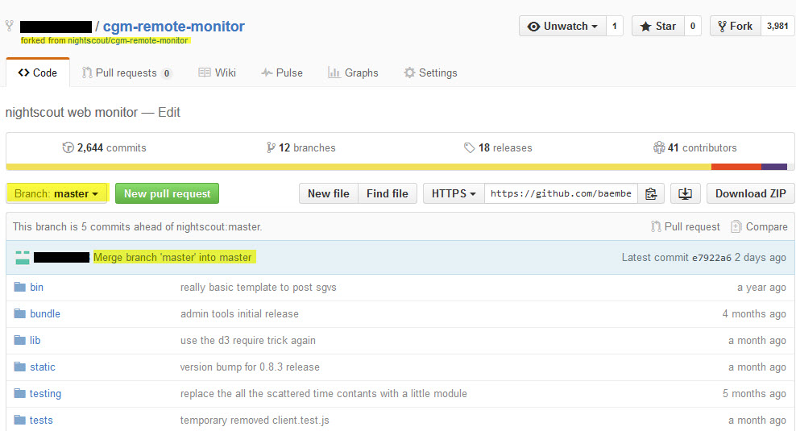

# GitHub

[GitHub](https://de.wikipedia.org/wiki/GitHub) ist ein webbasierter Filehosting-Dienst für Software-Entwicklungsprojekte. Software besteht aus vielen Files, die in einer Verzeichnisstruktur liegen. Diese Files enthalten den eigentlichen Programmiercode. Das `cgm-remote-monitor` repository enthält den Programmcode zum Aufbau der Nightscout Website.
Stellt ein Software - Entwickler etwas zur Verfügung, legt er die files in einem  **branch** ab. Der **branch** kennzeichnet Umgebungen. Im  **dev - branch** wird normalerweise entwickelt und getestet. Verlief alles erfolgreich, werden die geänderten files in den **master branch** verschoben (committed). Nighscout wird weiterentwickelt,  mit der Einteilung in  **branches ** lassen sich verschiedene Versionen einer Software managen.
Die  Files eines branches kopieren wir uns in unser eigenes Verzeichnis (Fork). 

Wir starten mit dem **Sign Up** auf der [GitHub Site](https://github.com/):

**Wichtig** ist auch hier, Benutzername und Passwort in das Datenblatt einzutragen.

Mit **Edit Profile** können wir uns unsere Einstellungen ansehen. 

**Billing:**

 Unter diesem Menüpunkt sind die Kosten aufgelistet, wichtig ist hier, das hier **Free** angezeigt wird:
 
 
 
 Wir suchen jetzt den **Programmcode**:
 
  Über die Suchfunktion jetzt `cgm-remote-monitor` eingeben:
 
 
 
 Den ** branch ** wie master oder dev auswählen und mit **Fork** kopieren wir den Code in unser eigenes Verzeichnis:
 
 
 
 
 Das Ergebnis mit unserem eigenen Branch:
 
 
 
 
 
 
 
 **Aktualisierung des eigenen `cgm-remote-monitor` repositories**
 
 Die Nightscout Website wird ständig weiterentwickelt. Diese Weiterentwicklung hat als Kennzahl die **Version**. Stand Januar 2016 hat der `cgm-remote-monitor` die Version 0.8.4.
 
 Über diesen [Weblink](http://nightscout.github.io/pages/update-fork/) können wir überprüfen, ob es bereits neuere Versionen gibt.
 Einfach den GitHub Account - Namen eingeben und **Check for Updates** klicken.
 
 
 
 
 
 
 
 Jetzt geht es weiter mit dem Einrichten von [Azure](../nightscout/azure.md).
 
 
 

