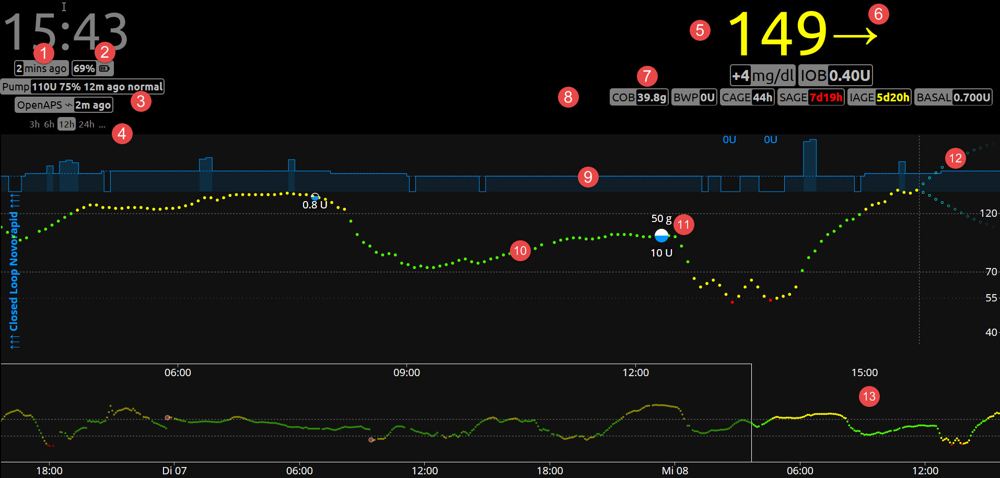

# Haupt Seite

Nightscout ist seit Oktober 2016 in der Version **0.9** - **Grilled Cheese** verfügbar. Wer Vorgängerversionen nutzt, muss Einstellungen für die Website in Azure oder Heroku überprüfen und ergänzen.

Variable unter den App - Einstellungen  zum Hinzufügen: `AUTH_DEFAULT_ROLES` mit `readable`, `status-only` als mögliche Werte.
evicestatus-Upload

Wenn wir die Website aktualisieren und feststellen, dass Dinge, die wir aktiviert haben, nicht richtig angezeigt werden (wie boluscalc), bitte folgendes überprüfen:

**Bitte Sicherstellen, dass es nur eine die ENABLE - Zeile in den gesamten Einstellungen der Website gibt. (Das bedeutet nur ein einziges Mal in den Gesamteinstellungen, einschließlich App-Einstellungen und Verbindungszeichenfolgen.)
 Wenn ENABLE in Connection Strings auftaucht , bitte in die App Settings verschieben. Speichern nicht vergessen und anschließend die Website Stoppen und Starten.**

**Grilled Cheese** benötigt ein **Profil**

Wenn wir zuvor kein Profil auf der Website eingerichtet haben, werden wir beim ersten Aufruf der Website aufgefordert,ein Profil zu erstellen. Wir können alle Informationen eingeben, oder nur die Zeitzone (und das Profil später bearbeiten). Wir müssen die Website authentifizieren, bevor wir die Profiländerungen speichern können. Um sich zu authentifizieren, verwenden wir den Link am unteren Rand des Profils Bildschirms und geben das **API SECRET** ein. Sobald wir authentifiziert sind, ändern wir das  Profil und klicken  dann auf **Speichern**. Wenn das Profil korrekt gespeichert ist, sehen wir  **Erfolg** unten und rechts oben. Wir können nun die Website öffnen.

Wir sehen uns nun die **Hauptseite:** an. Die Grafik wird alle 60 Sekunden aktualisiert.

Was sehen wir ?
  1. Zeit seit der Letzten CGM Sensor - Daten - Übertragung
  2. Batterie - Ladezustand des Smartphones
  3. Plugins für die Pumpensteuerung
  4. Zeitrahmen der Darstellung von Behandlungsdaten
  5. aktueller BZ - Wert
  6. Trendpfeilangabe
  7. Zunahme/Abnahme des BZ innerhalb von 2 Messpunkten
  8. Plugins mit Anzeige von  Werten wie  `Sensor - Alter` , `Insulin on Board`
  9. Basalratenverlauf
  10. CGM - Meßwerte
  11. Behandlungsdaten Kohenhydrate - und Insulineinheiten
  12. BZ - Trend - Voraussage
  13. Zeitfenster der Darstellung im oberen Bereich
  
  
In der rechten oberen Ecke finden wir **Menü - Auswahlfelder**.

**Bearbeitungsmodus**

`EDIT_MODE` (`on`) - mögliche Werte `on` oder `off`. Wenn diese Option aktiviert ist (rot) , kann man z.B. Behandlungsdaten grafisch mit der Maus bearbeiten, indem man eingegebene Werte auf der Zeitachse verschiebt.

Mit dem **Lautsprecher** - Symbol  kann man eingestellte Alarme testen.

Das Symbol mit den **3 Strichen** ist das Einstellungsmodul mit umfangreichen Möglichkeiten.

Mit dem Klick auf das  **+** - Symbol rufen wir das **Behandlungsportal** auf.

Mit dem **Taschenrechner** - Symbol gelangen wir zum **Bolus - Rechner**.

Um die Website weiter anzupassen rufen wir jetzt das [Einstellungen](../nightscout/settings.md) Menü auf.

