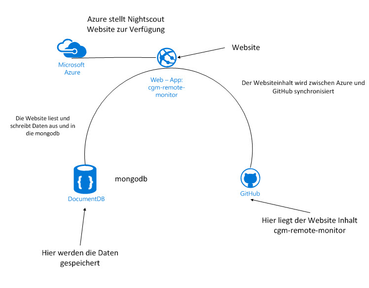

# Nightscout einrichten

Nightscout besteht aus **3 Komponenten**:

* Einer Dokumentations-Datenbank (MongoDB)  zur Speicherung von Blutglukose, Kohlenhydraten, Insulin, Aktivitäten usw. MongoDB ist eine Cloudanwendung und kann über das Internet erreicht werden.

* Einer **Web-Applikation**, welche über einen beliebigen Browser oder eine App aufgerufen  werden kann. Die Anwendung wird in einem Verzeichnis aktualisiert, welches über einen webbasierten Filehosting Dienst [**GitHub**](https://github.com/) verwaltet wird. Dieser Dienst ist grob vergleichbar mit Webdiensten wie z.B. Google Docs. Die Grundidee dabei ist, anderen ein Verzeichnis mit Dateien zur Verfügung zu stellen, damit man gemeinsam daran arbeiten kann. 

* Einem Cloud-Service Anbieter, welcher die Web-Applikation über Webserver zur Verfügung stellt. Microsoft [**Azure**](https://azure.microsoft.com/de-de/pricing/free-trial/) oder [**Heroku**](https://www.heroku.com/) können hierfür verwendet werden. Cloud-Service Anbieter betreiben weltweit Rechenzentren, man konfiguriert webbasiert wie hier Nightscout
diese Dienste.

Ein Schaubild verdeutlicht die Zusammmenhänge:

