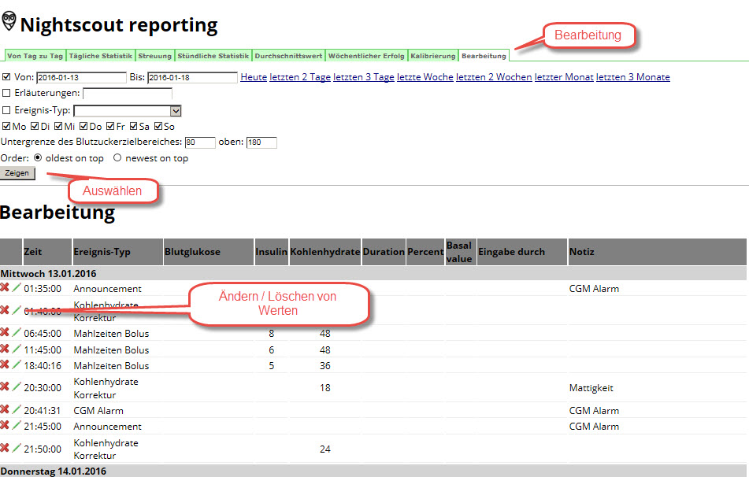
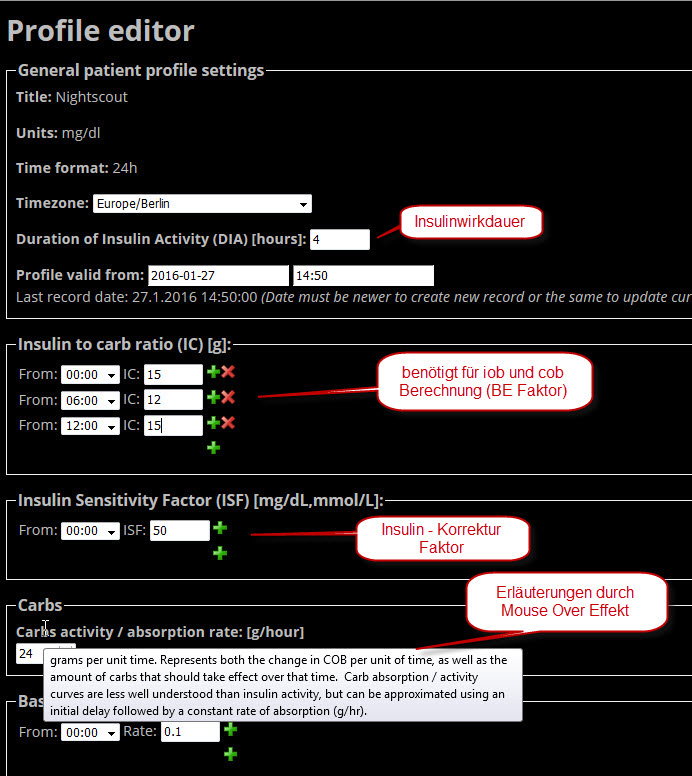
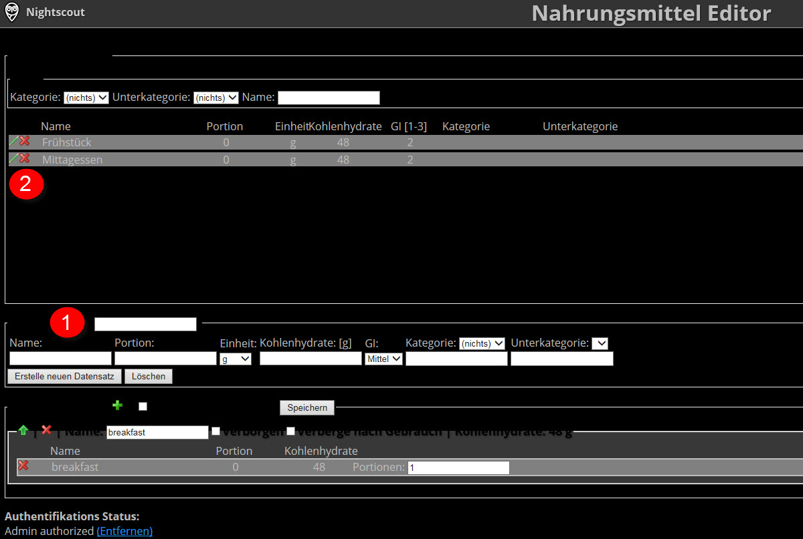
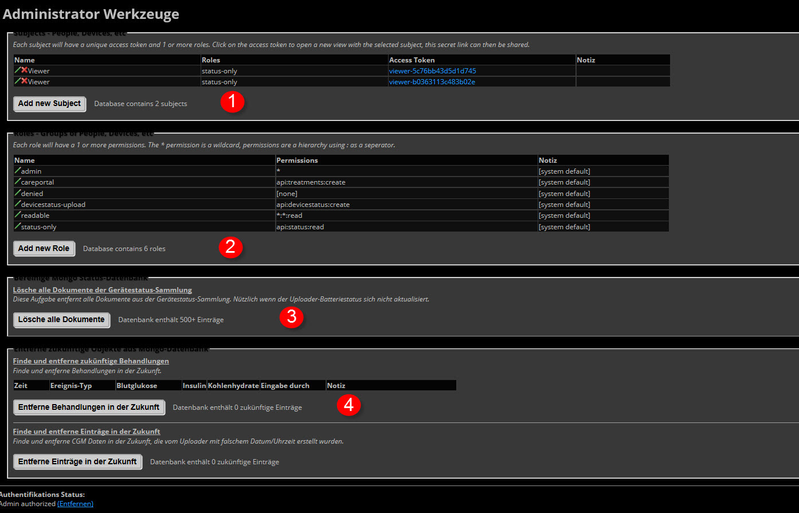
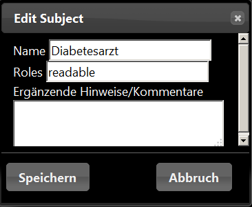

# Einstellungen

Die **Einstellungen** für die Website erreichen wir mit dem Klick auf das mit dem roten Pfeil markierte Symbol:

**Oben** haben wir die Wahl von 4 Menüpunkten:

  - [Berichte](../nightscout/settings.md#berichte)
  - [Profil - Editor](../nightscout/settings.md#profil---editor)
  - [Nahrungsmittel Editor](../nightscout/settings.md#nahrungsmittel-editor)
  - [Administrator Werkzeuge](../nightscout/settings.md#administrator-werkzeuge)
   
**Unten** sind die Browsereinstellungen gelistet. Wenn wir diese zentral für alle Browser gleich halten wollen, können wor dieses wie in Kapitel [Nightscout Plugins](../nightscout/azure_plugins.md) beschrieben, umsetzen.

  
  
###Berichte

Mit dem Klick auf **Berichte** erhalten wir diese Ansicht: 

Die **Report - Arten** sind umfangreich. Wir können sie uns mit Klicks auf den Namen aufrufen.
Mit der Eingabe der **Zeiträume** bestimmt man den Report - Umfang. Wir können vorgefertigte Zeiträume und individuelle Zeiträume auswählen. Weitere Filter sind möglich.
Wir starten die Ausgabe des Reports mit dem Klick auf **Zeigen**.

Mit dem Report **Von Tag zu Tag** gibt es alle Daten auf einen Blick:

Wir haben auch die Möglichkeit, eingegebene Werte mit dem Klick auf **Bearbeitung** zu **Korrigieren** oder zu **Löschen**:

###Profil - Editor

Der Behandlungs Profil Editor speichert angepasste Werte für die persönliche Therapie.Mit dem Profil - Editor konfigurieren wir Einheiten und Werte für Plugin iob, cob, bwp und Basalraten.

**Wichtig:** Ohne Änderugen im Editor werden für die Plugins keine verwendbaren Werte angezeigt. Seit Grilled Cheese, Version 0.9 ist das Anlegen eines Profils beim ersten Aufruf der Website erforderlich.

Wenn wir die Maus oder den Finger über Fachbegriffe bewegen, werden **Erklärungstexte** in englischer Sprache angezeigt.

Bei **Timezone** bitte die gewünschte Zeitzone Einstellen. 

Mit **Duration of Insulin Activity (DIA)** definieren wir die Wirkdauer des Bolus - Insulins. Die Plugins iob, bwp  benötigen diese Eingaben.

Mit Insulin to carb ratio (IC) wird angegeben, wieviel Boluseinheiten für eine definierte Menge an KH verwendet werden müssen. Die Plugins iob und cob benötigen diese Eingaben.

Mit dem **Insulin Sensitivity Factor (ISF)** können wir den Korrekturfaktor in mg/dl oder mmol/L angeben. Mit mehrfachen Eingaben können unterschiedliche Faktoren bestimmt werden. 

Mit **Carbs activity /absorbtion rate (g/hour)** können wir bestimmen, wieviel Gramm Kohlenhydrate pro Stunde verstoffwechselt werden. Das Plugin cob benötigt diese Eingaben.

####Nahrungsmittel Editor

Im Nahrungsmittel - Editor können wir Mahlzeiten Mit Angabe von Bezeichnung , Kategorie und Kohlenhydraten. Daten sind für den **Bolus Kalkulator** optional wählbar. Über Ernährungsprogramme lassen sich die Daten über csv- oder json - Format in die **mongodb** übertragen.

 1.  Eingabe von Nahrungsmittel - Daten
 2. Ändern, Löschen von Datensätzen

####Administrator Werkzeuge

Mit den Administrator - Werkzeugen können wir Berechtigungen zum Zugriff auf die Nightscout - Website verwalten und Datensätze aus der mongo DB löschen. 

#####Verwalten von Berechtigungen

Für Berechtigungen benötigt man **Subjekte** (Menschen, Institutionen, etc.), denen man eine Rolle zuweist. Für jedes Subjekt wird ein **Zugriffstoken** generiert, mit dem der Betrachter Zugriff auf die Website bekommt. Dieses Token muss man dem Betrachter mitteilen. Innerhalb der Rolle werden Zugriffsberechtigungen verteilt, das höchste Recht ist Vollzugriff, symbolisiert durch ein `*`- Symbol, das niedrigste ist **kein Zugriff**.

1. Anlegen von Subjekten

2. Anlegen von Rollen

Es gibt standardmäßig 6 Rollen, die in den meisten Fällen ausreichend sind. Hinter den Rollen sind die Zugriffsrechte gelistet.
Man kann eigene Rollen wie beim anlegen von Subjekten definieren und speichern.

3. Löschen von Dokumenten

Es ist möglich, die Gerätestatus - Sammlung (Collection in der mongo db) mit diesem Menüpunkt zu löschen.

4. behandlungsdaten in der Zukunft

Mit diesem Punkt kann man fälschlicherweise Behandlungen mit Datum in der Zukunft aus der Datenbank löschen.

