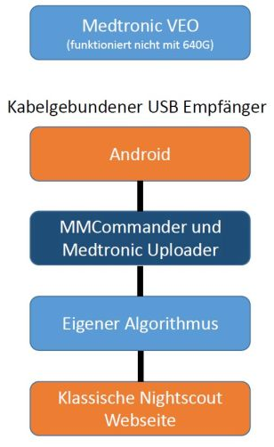

# Enlite

Eine generelle Beschreibung des Enlite Sensors bietet der Hersteller Medtronic an: [Link Enlite Glukosesensor](https://www.medtronic-diabetes.de/minimed-produkte/kontinuierliche-glukosemessung/enlite-glukosesensor). Auch gibt Medtronic eine [Infobroschüre](https://www.medtronic-diabetes.at/sites/austria/medtronic-diabetes.at/files/cgm_broschuere_052012.pdf) zu diesem Thema heraus, die allerdings von 2012 ist und sich daher nur mit dem Enlite Sensor in Verbindung mit der VEO Insulinpumpe beschäftigt.

Grundsätzlich gibt es zwei verschiedene Transmitter von Medtronic, mit denen der aktuelle Enlite Sensor verbunden werden kann:
1.  
der MiniLink Transmitter, kompatibel mit dem MiniMed Veo System und dem Guardian REAL-Time System und den
2. 
Guardian 2 Link Transmitter, der nur mit der MiniMed 640G Insulinpumpe kompatibel ist.

Da sich die Wege zum erfolgreichen Nightscout-Betrieb gravierend unterscheiden, werden diese in den folgenden Unterkapiteln getrennt betrachtet.

 
## 1.2.2.2 MiniLink Transmitter
Mit dem MiniLink Transmitter und der Medtronic Veo Insulinpumpe gibt es eine von Nightscout veröffenlichte Möglichkeit die Daten zur Nightscout Webseite zu bekommen.

###Übersichtsgrafik

Danach stehen einem die in den Kapiteln 3 [Die Nightscout Hauptseite](../../nightscout/die_nightscout_website.html) und 4 [Smartwatch Integration](../../smartwatch/smartwatch_integration.html) genannten Möglichkeiten zur Verfügung.

Um das zu Realisieren muss man den MMCommander bauen und mit der entsprechenden Software bespielen. Zusätzlich muss noch auf einem kompatiblen Android Smartphone die Medtronic Uploader App installiert und konfiguriert werden. Beides ist im Kapitel 1.3 [MMCommander](../grundlagen/cgm/mmcommander.html) beschrieben.

## 1.2.2.3 Guardian 2 Link Transmitter

Offiziell wird der Guardian 2 Link Transmitter und dadurch die Minimed 640G Insulinpumpe noch nicht von NightScout unterstützt [(s. englische Nightscout Übersicht)](http://www.nightscout.info/wiki/faqs-2/how-do-you-get-your-cgm-in-the-cloud). 

Ganz die Hoffnung aufgeben muss man mit der Minimed 640G aber dennoch nicht, da es mittlerweile ein recht vielversprechendes Projekt gibt, das die 640G erfolgreich in Nightscout eingebindet. Für alle Interessierten, die der englischen Sprache mächtig sind, bietet sich ein Blick auf [Matt's Little D Blog an.](http://littlet1d.blogspot.co.uk/)

Speziell im [Beitrag vom 29.12.15](http://littlet1d.blogspot.com/2015/12/nightscout-on-640g-on-go_29.html) geht Matt auf den aktuellen Stand des Projektes ein und dieser Beitrag enthält auch Verweise auf seine früheren Beiträge, die zum Verständnis erforderlich sind.

