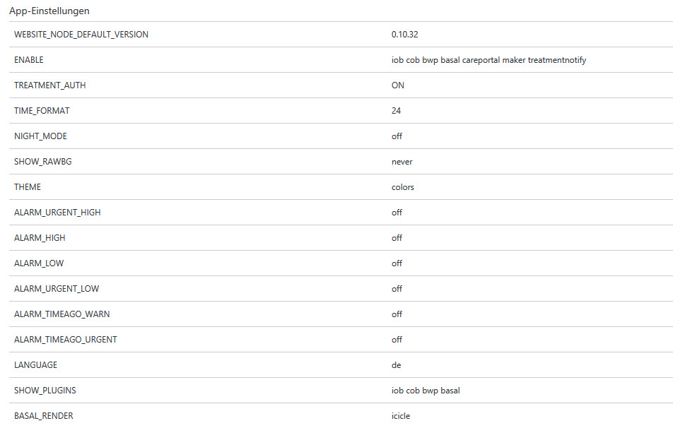

# Plugins

Das Erscheinungsbild und der Funktionsumfang der Nightscout Website können weiter konfiguriert werden. 

Konfiguration des **Erscheinungsbildes**:

Wir können einige Standard Plugins **deaktivieren**, die standardmäßig aktiv sind. Dieses erfolgt über den DISABLE Parameter in den Azure App. Einstellungen:

 
| Plugin |  Hinweise |
| -- | -- |
|delta | berechnet und zeigt die Veränderung zwischen den letzten beiden BZ - Werten an|
|direction |zeigt den Blutzuckertrend an|
|upbat |zeigt den aktuellsten Batterieladezustand des Uploader - Smartphones an|
|errorcodes |erzeugt Alarme für CGM Fehlermeldungen |
|ar2 | erzeugt Alarme basierend auf prognostizierten Werten|
|simplealarms |nutzt BG_HIGH, BG_TARGET_TOP, BG_TARGET_BOTTOM, BG_LOW Schwellenwerte, um alarme zu erzeugen|

Wir können **Browsereinstellungen** zentral in den Azure App. Einstellungen speichern. Dieses hat den Vorteil, das man egal von welchem Browser oder einer Smartphone App immer die gleichen Einstellungen hat. Machen wir dieses nicht, werden diese nur im Browser Cache gespeichert und müssen sehr häufig neu eingegeben werden. Jeder Parameter mit Wert steht in einer extra Zeile.

|Parameter |  Wert |Beschreibung|
| -- | -- |-- |
|TIME_FORMAT |24| mögliche Werte 12 oder 24|
|LANGUAGE |de| Begriffe in deutscher Sprache|
|NIGHT_MODE |off|  mögliche Werte on oder off|
|SHOW_RAWBG |never|  mögliche Werte: always, never oder noise|
|CUSTOM_TITLE |My NS|  Individueller Name der Website|
|THEME |default|  mögliche Werte: default oder colors|
|BASAL_RENDER|default|mögliche Werte: default, icicle|
|ALARM_URGENT_HIGH |on|  mögliche Werte: on oder off|
|ALARM_HIGH |on|  mögliche Werte: on oder off|
|ALARM_LOW |on|  mögliche Werte: on oder off|
|ALARM_URGENT_LOW |on|  mögliche Werte: on oder off|
|ALARM_TIMEAGO_WARN |on|  mögliche Werte: on oder off|
|ALARM_TIMEAGO_WARN_MINS |15|  Minuten seit des letzen Lesens um eine Warnung auszugeben|
|ALARM_TIMEAGO_URGENT |on|  mögliche Werte: on oder off|
|ALARM_TIMEAGO_URGENT_MINS |30|  Minuten seit des letzen Lesens um eine alarmierende Warnung auszugeben|
|SHOW_PLUGINS|  enabled |Zeigt an, welche Plugins in der Grafik angezeigt werden sollen. Diese müssen vorher mit ENABLE bei den Azure App.-Settings konfiguriert sein|

Nach Eingabe der Daten das **Speichern** nicht vergessen.

Die Einstellungen sehen dann so aus:

Anbindung der **Share2Nightscout Bridge** Funktionalität

Die Share2Nightscout Bridge Funktionalität ist derzeit nur für Dexcom Share Benutzer interessant. Die Verbindung zum Dexcom G5 System wird in Zukunft hierüber konfiguriert.
Um die Bridge Funktionalität nutzen zu können, müssen wir **bridge** zu ENABLE ind den App-Einstellungen hinzufügen.
 
 Nutzer der Share2bridge Funktionalität können ihr Parameter  in den Connection Strings konfigurieren:
 
 Share2Nightscout Bridge Parameter:
 
 
|Parameter |  Beschreibung |
| -- | -- |
|BRIDGE_USER_NAME |Erforderlich: Benutzername des Dexcom Share Accounts|
|BRIDGE_PASSWORD |Erforderlich: Passwort des Dexcom Share AccountsShare Accounts|
|BRIDGE_INTERVAL |Optional: Wartezeit zwischen jedem  Update. Der Standardwert ist 150000 – 2.5 minutes.
|BRIDGE_MAX_COUNT |Optional: Die maximale Anzahl der Datensätze zum Upload. Der Standardwert ist 1.|
|BRIDGE_FIRST_FETCH_COUNT |Optional: Maximale Anzahl der Datensätze während des ersten Uploads. Der Standardwert ist 3|
|BRIDGE_MAX_FAILURES |Optional: Maximale Anzahl der Fehler beim Empfang.  Der Standardwert ist 3|
|BRIDGE_MINUTES |Optional: Das Zeitfenster für die Suche nach neuen Daten pro Update. Der Standardwert ist Zeit in Minuten – 1400|
 
 
 

    
    BG_HIGH (260) – This value must be set using mg/dl units; the high BG outside the target range that is considered urgent.
    BG_TARGET_TOP (180) – This must be set using mg/dl units; the top of the target range, also used to draw the line on the chart.
    BG_TARGET_BOTTOM (80) – This must be set using mg/dl units; the bottom of the target range, also used to draw the line on the chart.
    BG_LOW (55) – This must be set using mg/dl units; the low BG outside the target range that is considered urgent.
    ALARM_TYPES (simple if any BG_* ENV’s are set, otherwise predict) – Currently 2 alarm types are supported, and can be used independently or combined. The simple alarm type only compares the current BG to BG_ thresholds above, the predict alarm type uses highly tuned formula that forecasts where the BG is going based on it’s trend. predict DOES NOT currently use any of the BG_* ENV’s.
    BASE_URL – Used for building links to your sites api, ie pushover callbacks, usually the URL of your Nightscout site you may want https:// instead of http://.
    
    
    

    
    
    
