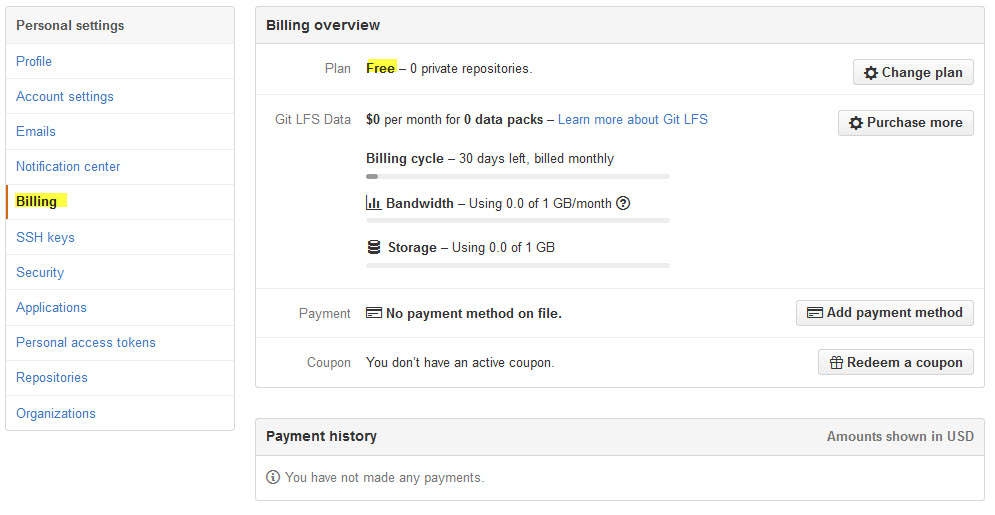

# GitHub

[GitHub](https://de.wikipedia.org/wiki/GitHub) ist ein webbasierter Filehosting-Dienst für Software-Entwicklungsprojekte. Der eigentliche Quellcode liegt hier und kann von mehreren Nutzern bearbeitet werden. Die Verwaltung der Zusammenarbeit übernimmt GitHub.

Wir starten mit dem **Sign Up** auf der [GitHub Site](https://github.com/):

Wichtig ist auch hier, Benutzername und Passwort in das Datenblatt einzutragen.

Mit **Edit Profile** kann man sich seine Einstellungen ansehen. 

**Billing:**

 Unter diesem Menüpunkt sind die Kosten aufgelistet, wichtig ist hier, das hier **Free** angezeigt wird:
 
 
 
  Über die Suchfunktion jetzt cgm-remote-monitor eingeben:
 
 
 
 
 
 After creating your account and are logged in, open the master repository by clicking here -> cgm-remote-monitor
Make a copy (“Fork”) of the nightscout/cgm-remote-monitor to your own repository by clicking on the ‘Fork‘ button on top right
OR – just click here -> fork the cgm-remote-monitor
When prompted with ‘Where should we fork this repository?‘, select your @<gitaccountname>, and it will Fork to your repository.
At the top of the page, you will now see <gitaccountname>/cgm-remote-monitor indicating you have your own copy forked from Nightscout.
 
 

