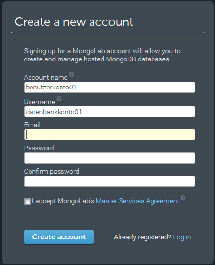
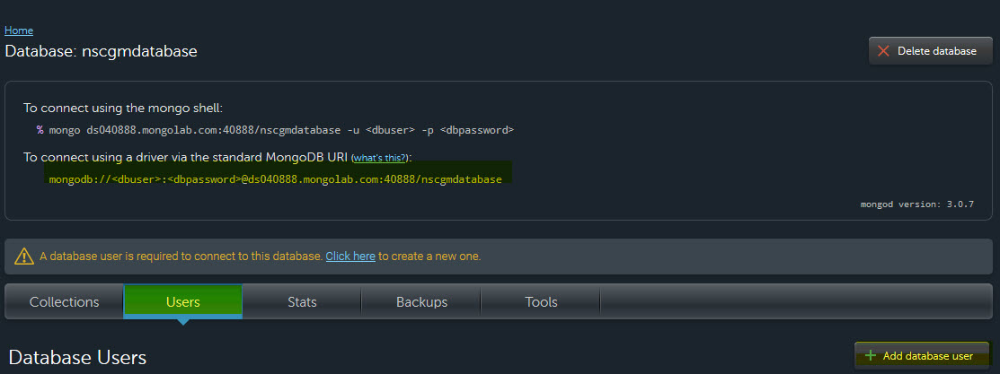

# 

Die [Mongo DB Datenbank](https://en.wikipedia.org/wiki/MongoLab) ist eine Dokumentations - DB und ist das Daten - Backend der Nightscout Website. Es handelt sich um eine Cloud - Datenbank in Rechenzentren der USA und Europa. 
Mongo DB gibt es als **kostenlose** Sandbox - Variante.

Bevor man mit der Konfiguration loslegen kann, ist es wichtig, das Datenblat auszudrucken
und auszufüllen:
[Link zum datenblatt deutsch](https://www.docdroid.net/tG5Zpkh/der-reissverschluss.pdf.html)
Es ist für weitere Konfigurationen wichtig, dieses Datenblatt sicher aufzubewahren.

Die URL zum Start gibt es hier: https://mongolab.com

Wir starten mit der Einrichtung der Benutzer - Konten auf der mongolab - Startseite:

**SIGN UP:**

Weiter gehts mit dem **Anlegen** der benötigten **Konten:** zur Verwaltung 

**Passwörter**

Der Einfachheit halber kann man den selben Benutzernamen (Account name) für die Verwaltung von mongolab als auch für den Datenbanknutzer (Username) nutzen, muss es aber nicht. Hauptsache: **Alles notieren**. Auch sind eigene Passwörter nur für mongolab sinnvoll, es sollten auf keinen Fall bereits bekannte Passwörter, welche man für andere Anlässe wie Online-Banking genutzt
werden, verwendet werden.

**Überprüfung Email:**

Nachdem der Account eingerichtet wurde, bitte einmal im Postfach der angegebenen Email - Adresse die Bestätigungs - Email suchen. Durch Klick auf den Link wird man auf die Seite
zur Einrichtung einer Datenbank geleitet.

**Anlegen einer Datenbank:**

Wir starten mit dem Klick:

Alle gelb markierten Punkte sind auszufüllen, der Datenbankname ist frei wählbar:

Nachdem der Button **Create new MongoDB deployment** geklickt wurde, erscheint eine Erfolgsmeldung:

Durch Doppelklick auf den Namen, hier: ds040888/nscgmdatabase richtet man u.a. den Datenbankbenutzer ein. Das ist derjenige, welcher in Azure oder xdrip konfiguriert wird,
um auf die mongodb zuzugreifen:

**Datenbankbenutzer Anlegen:**

..und die vorher notierten Daten eingeben:

